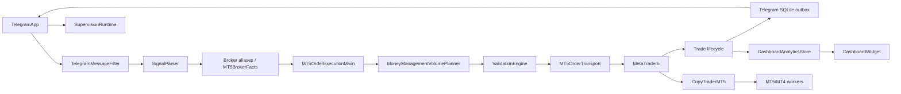

🌐 Language: [Français](./COMPLETE_TECHNICAL_INVENTORY_NOVABOT_2026-08-08_FR.md) | [English](./COMPLETE_TECHNICAL_INVENTORY_NOVABOT_2026-08-08_EN.md)

---

# Complete Technical Inventory of NovaBOT

Initial inventory date: August 8, 2026  
Last verification and update: August 10, 2026  
Source of truth: source code in `NOVABOT-WORKING v225`  
Document type: reference static/dynamic mapping; no source-code changes

## 1. Scope and method

This inventory covers all 310 useful files, excluding generated `__pycache__` and `.pyc` artifacts. Existing documents were used only for cross-checking; counts, symbols, imports, persistence, wiring, and contracts were verified in current code.

Method: complete tree classification; AST analysis of 190 Python files; implementation and `main.py` wiring review; file/SQLite/Telegram/MT5/MT4/ZeroMQ access search; import/call-chain reconstruction; review of all 65 test modules and 800 test methods; and comparison with compilation/test results obtained on this same copy.

### 1.1 Counting conventions

| Measure | Convention |
|---|---|
| Production/technical Python file | Any `.py` outside `validation/tests`, including scripts, PyInstaller hook, and vendored QR library. |
| Function | `FunctionDef`/`AsyncFunctionDef` without a class ancestor. |
| Method | Function with a class ancestor; production code contains 1,531 direct methods and 59 method-local callbacks. |
| PyQt signal | Static assignment to `pyqtSignal(...)`. |
| Timer | Six recurring `QTimer` objects plus fifteen `singleShot` scheduling sites. |

### 1.2 Quantitative results

| Item | Production/technical | Tests | Total |
|---|---:|---:|---:|
| Python files | 125 | 65 | 190 |
| Classes | 156 | 160 | 316 |
| Functions | 351 | 33 | 384 |
| Methods/callbacks | 1,590 | 1,174 | 2,764 |
| Constructors | 97 | 49 | 146 |
| Async functions/methods | 46 | 21 | 67 |
| Properties | 20 | 0 | 20 |
| Dataclasses | 25 | — | 25 |
| Enums | 3 | — | 3 |
| Decorated PyQt slots | 11 | — | 11 |
| Declared PyQt signals | 33 | — | 33 |

The tree also contains 80 language JSON files, 18 PNGs, 11 Markdown files, 5 BAT files, 2 PowerShell scripts, one PyInstaller SPEC, one ICO, one MQ4 EA, and one text notice.

### 1.3 Technical delta verified since the initial inventory

Two production modules are new: `app/telegram/telegram_destination_binding.py` and `app/core/windows_vc_runtime.py`. Six additional test modules characterize Telegram destination binding, typography, the Copy Trader Settings button, actual-entry TP adjustment, Visual C++ Runtime detection, and the all-groups split-entry mode. Other v225 changes are implemented in existing files, mainly `connect_telegram.py`, `telegram_notification_outbox.py`, `money_management.py`, `mt5_order_execution.py`, `mt5_trade_lifecycle.py`, `mt5_trade_monitoring.py`, `connect_metatrader_mt5.py`, `app/onboarding/*`, `display_adaptation.py`, `about_dialog.py`, `copy_trader_mt5.py`, `main.py`, and the language catalogs.

## 2. Packages and entry points

`app` is a namespace package. `app.core`, `app.mt5`, `app.telegram`, `app.copy_trader`, and `app.workers` are namespace subpackages; `app.dashboard`, `app.onboarding`, and `app.supervision` expose `__init__.py` facades. `validation` is a regular package, with namespace subpackages for market, rules, and scoring.

| Package | Technical role | Status |
|---|---|---|
| `app.core` | preferences, profiles, i18n, display, atomic storage, analytics | infrastructure |
| `app.telegram` | Telethon session, listener, filter, forwarding, Smart, outbox | active |
| `app.mt5` | connection, parser, admission, execution, actions, lifecycle | active |
| `app.dashboard` | analytics projection and UI | UI |
| `app.copy_trader` | MT5→MT5/MT4 replication orchestrator | optional active |
| `app.workers` | multiprocessing source/target and MT4 ZeroMQ bridge | infrastructure |
| `app.onboarding` | profile setup checklist | UI |
| `app.supervision` | read-only remote projection | optional infrastructure |
| `validation` | models, market context, rules, scoring, history | optional active |

Primary entry points are `main.py/main()`, `main.bat`, `main.ps1`, the multi-profile launcher, build/backup BAT files, `scripts/diagnostic_supervision_distante.py`, MT4 installer scripts, `worker_main`, `mt4_worker_main`, `rthooks/freeze_support.py`, `NovaBot.spec`, and the MT4 EA. The only explicit application CLI option is `--profile`.

## 3. External dependencies

PyQt5 owns UI/signals/threads/timers; Telethon owns Telegram; MetaTrader5 owns broker access; cryptography/Fernet protects credentials; pyzmq transports MT4 commands/events; SQLite stores analytics/outbox; multiprocessing hosts workers; Windows ctypes/DPAPI handles process integration/token protection; optional pywinauto activates MT5 Algo Trading; vendored qrcodegen creates pairing QR codes. Standard-library dependencies include filesystem, JSON, datetime, typing/dataclasses, regex, threading, math/time, subprocess, socket, HTTP, and urllib.

## 4. Component graph and main wiring

`MainWindow._wire_signals` connects Telegram trade envelopes to MT5, MT5 publications to Telegram, durable outbox acknowledgements to lifecycle, selected sources to identity/Dashboard, the Smart detector to Telegram filtering, the primary MT5 session to Copy Trader, and status events to supervision.

## 5. Concurrency, workers, asyncio, and timers

Four QThreads are defined: Telegram `AsyncWorker`, Telegram `LoopRunner`, MT5 connection/symbol worker, and Dashboard snapshot worker. Copy Trader can start one MT5 source process and one MT5/MT4 target process. Supervision uses one HTTP thread. Telegram's dedicated asyncio loop runs inside `LoopRunner`. The MT4 installer is a temporary PowerShell child process.

The recurring timers are Copy Trader poll (150 ms), installer poll (500 ms), Dashboard refresh (30 s), MT5 watchdog (2.5 s), lifecycle/BE poll (2 s), and onboarding refresh (1.5 s). Thirteen `singleShot` sites handle deferred UI, auto-connect, icon/display refresh, and asynchronous completion.

## 6. PyQt signals and slots

The 33 signals belong to Dashboard snapshot/Widget, MT5 connection worker/MT5App, Onboarding coordinator/dialog, Telegram AsyncWorker/dialogs/TelegramApp. They carry worker results, status, trade publications, supervision events, reconnect and destination-issue state, selected-source changes, setup readiness, and durable outbox acknowledgement.

Eleven decorated PyQt slots were identified. They include Telegram publication, bot completion, phone/code dialogs, button/status refresh, reconnect/destination handling, worker completion, and chat-list completion.

## 7. Routes and protocols

Supervision exposes only GET `/supervision/health`, `/identity`, `/snapshot`, and `/events?after=N`; private-mode protected routes require Bearer auth. HEAD/POST/PUT/PATCH/DELETE/OPTIONS/TRACE/CONNECT return 405.

Telegram uses Telethon client calls and handlers, not webhooks. MT5 reads go through `MT5BrokerFacts`; actions go through `MT5ActionGateway.send_order`, then order/position transports. MT4 uses ZeroMQ `tcp://127.0.0.1:6001` commands and `:6002` events. `%TEMP%/NovaBot_MT4_bridge_6002.json` records bridge ownership.

## 8. File-by-file inventory

### 8.1 Root, build, and core

| File | Role / main symbols | State |
|---|---|---|
| `main.py` | `ProfileDialog`, `MainWindow`, startup/profile lock/delayed imports/wiring/shutdown | active UI |
| BAT/PS1 launchers | developer, multi-profile, build, and backup entry points | infrastructure |
| `NovaBot.spec`, `rthooks/freeze_support.py` | PyInstaller data/hidden imports and multiprocessing hook | build infrastructure |
| `scripts/diagnostic_supervision_distante.py` | standalone argparse HTTP diagnostic | active utility |
| `app/core/about_dialog.py` | About dialog/buttons and release metadata | UI |
| `app/core/app_preferences.py` | language/theme/display/font/startup settings | infrastructure |
| `app/core/atomic_json.py` | atomic temp/fsync/replace JSON write | infrastructure |
| `app/core/dashboard_analytics.py` | SQLite schema and Telegram/parser/execution/terminal recording | active store |
| `app/core/dashboard_statistics.py` | periods, aggregation, scoring, totals | active service |
| `app/core/display_adaptation.py`, `display_policy.py` | display controller and immutable `DisplayPlan` policy | UI/infrastructure |
| `app/core/documentation.py`, `i18n.py` | documentation UI and eight translation domains | infrastructure |
| `app/core/launch_options.py` | `extract_profile_argument` | active |
| `app/core/profile_json_store.py`, `profile_manager.py` | tolerant/atomic store, profiles, safe ZIP, PID locks | active infrastructure |
| `app/core/startup_settings_dialog.py` | startup/display/supervision/token/QR settings | UI |
| `app/core/tab_bar_adaptation.py`, `typography.py` | stable tab sizing and font scaling | UI infrastructure |
| `app/core/windows_vc_runtime.py` | `VisualCppRuntimeStatus`; Windows architecture/registry detection and official VC++ runtime URL | active infrastructure |

### 8.2 Dashboard and onboarding

`app/dashboard/dashboard.py` defines `_SnapshotWorker(QThread)`, `_SortableItem`, and `DashboardWidget`. It owns period/source selection, refresh timer, sortable rows, details, non-destructive source reset, themes, and formatting.

Onboarding files define `OnboardingRepository`, immutable `SetupStep`/`StepState`, `OnboardingService`, `OnboardingCoordinator(QObject)`, and `OnboardingDialog`. Repository owns `onboarding.json`; service evaluates eight existing module states; coordinator owns navigation/timer/signals; dialog owns presentation.

### 8.3 MT5 files

| Area | Files / symbols | Role |
|---|---|---|
| Facade | `connect_metatrader_mt5.py`: `ConnectionDialog`, worker, `MT5App` | UI, settings, connection, parser, correlation, validation, lifecycle composition |
| Composition/state | `mt5_composition.py`, `mt5_runtime_state.py`, `lifecycle_runtime_state.py` | stable mixin order and mutable state owners |
| Discovery/startup | `metatrader_discovery.py`, `metatrader_server_discovery.py`, `mt5_startup.py`, `symbol_info_store.py` | cached terminal/server discovery and stable symbol cache |
| Reads/actions | `mt5_broker_facts.py`, `mt5_action_gateway.py` | MT5 read and write gateways |
| Admission | `execution_admission_policy.py` | geometry, asset family, automatic/point tolerances |
| Historical policy | `execution_order_policy.py` | old slippage decision, production-unwired |
| MM | `money_management.py`, repository, volume planner, `trade_numeric.py` | settings/UI, capital/risk/volume/split/offset |
| Parser/aliases | `signal_parser.py`, parser adapters, `symbol_aliases.py` | text instructions and broker resolution |
| Execution | `mt5_order_execution.py`, `mt5_order_transport.py`, protocol | admission→validation→orders and filling fallbacks |
| Position actions | `mt5_position_actions.py`, `mt5_position_transport.py`, `trade_protection_policy.py` | close/partial/BE/SL/TP/pending |
| Smart close | `mt5_smart_close.py`, `smart_action_gateway.py`, `smart_command_executor.py` | scoped composite Smart actions |
| Monitoring/classification | `mt5_trade_monitoring.py`, `mt5_trade_classifier.py` | readiness/duplicates/ticks/history/closure cause |
| Lifecycle | `mt5_trade_lifecycle.py`, watchlist/ACK/terminal event/transition/publishers | persistent tracking and idempotent terminal publication |
| Presentation | `mt5_trade_messages.py` | MT5-independent trade message rendering |
| Analytics evidence | dashboard terminal evidence/archiver | attributable terminal facts to Dashboard |
| Correction | `telegram_signal_correction.py` | safe in-place edited-signal changes |
| Stores/math | `trade_log_store.py`, `progressive_tp.py`, `mt5_trade_math.py` | trade log, partial-close policy, pips/euros/prices |

`MT5DomainMixins` order is execution, position actions, Smart close, monitoring, lifecycle, classifier, messages, and math. `MT5OrderExecutionMixin.execute_trade` normalizes, resolves, admits, prices, calculates volume, validates, sends, publishes, and arms tracking. `MT5TradeLifecycleMixin` contains 67 methods covering restoration, TP/BE, split branches, pending orders, manual events, progressive closes, terminal evidence, publication, and cleanup.

### 8.4 Telegram files

`connect_telegram.py` defines `AsyncWorker`, `LoopRunner`, phone/trade/messages/chats/API/outbox dialogs, and `TelegramApp`. It owns Telethon connection, authorization, bot/private group, listening, source selection, filtering, forwarding/copy, reply mapping, edited/deleted handlers, durable outbox, reconnection, and the MT5 bridge.

Supporting modules are bot-admin promotion; selected-chat/profile settings stores; filter defaults/store/engine/policy/contracts/dialog; forward-map store; deleted-message audit; SQLite outbox and delivery service; `telegram_destination_binding.py` with immutable `TelegramDestinationBinding` and its profile repository; reconnect dataclass/policy; Smart persistence/detector/resolver/engine; and Telegram correlation state/service.

`SmartAutomationEngine` owns dictionaries/detection/context/validation/dispatch but not raw MT5 actions. `TelegramNotificationOutboxStore` owns schema migration, corruption recovery, leases, ordering, retry/dead-letter/context, and pruning.

### 8.5 Copy Trader, workers, and MT4

`copy_trader_mt5.py` defines dataclasses `ConnInfo`/`AppState` and `CopyTraderMT5`. It owns UI, encrypted state, terminal/server discovery, shared/manual source, worker processes/queues, initial-sync review, inventories, aliases, target-ticket mapping, OPEN/UPDATE/CLOSE replication, installer, and shutdown.

`mt5_worker.py` defines `ConnectReq`, `StopReq`, `OrderCmd`, `EventMsg` plus connection, symbol scoring, target actions, source inventory, transitions, and loop. `mt4_worker.py` defines `MT4TerminalLauncher`, Windows PID/port ownership helpers, rotating logs, JSON/ZeroMQ bridge, and loop. The MQ4 EA is the target executor; installer scripts deploy mql-zmq and EA files.

### 8.6 Supervision

The package defines immutable identity/event/batch/snapshot dataclasses; thread-safe `SupervisionProjection`, `SupervisionEventStream`, `SupervisionRuntime`; passive `DesktopStateObserver`; settings/token/DPAPI/network/pairing services; `SupervisionTransportService`; and read-only `SupervisionHttpTransport`. Vendored `QrCode`, `QrSegment`, `_BitBuffer`, and `DataTooLongError` support pairing.

### 8.7 Validation

`validation/config.py` defines slots dataclasses `SymbolValidationConfig`/`ValidationConfig`; `models.py` defines `TradeSide`, `DecisionStatus`, `RuleSeverity`, and slots dataclasses `Signal`, `MarketSnapshot`, `RuleResult`, `ValidationDecision`. `MarketContext` owns facts/EMA/ATR. Rules cover broker metadata, geometry, spread, trend, ATR, volume, and risk. `ValidationRuleEvaluator`, `DecisionManager`, and `ValidationEngine` own evaluation/scoring/decision. `ValidationHistoryStore` is the fail-open CSV writer.

### 8.8 Languages and resources

Ten language folders each contain `main`, `telegram`, `mt5`, `copy_mt5`, `dashboard`, `documentation`, `notifications`, and `onboarding` JSON catalogs. PNG/ICO resources provide logos, settings/profile-status icons, documentation/dictionary icons, and language flags.

## 9. Class, function, and method responsibilities

### 9.1 UI/orchestration

`ProfileDialog` builds profile/language/theme/actions and executes create/delete/import/export/accept. `MainWindow` builds four tabs, initializes supervision/onboarding, wires modules, projects identity state, and performs orderly shutdown. `DashboardWidget` owns asynchronous snapshots and visible statistics. About, documentation, startup-settings, display-adaptation, and onboarding classes own presentation and delegate business state to services/repositories.

### 9.2 MT5

`MT5App` direct methods group into UI, logging, credentials, connection/watchdog, settings/MM delegation, snapshots/validation, parser/symbol cache, Telegram correlation, external-message execution, Smart calls, and supervision events. Its mixins own domain behavior.

`MT5OrderExecutionMixin` call sequence is `_normalize_execution_params` → `_resolve_execution_symbol` → `_initialize_execution_batch` → `_prepare_trade_admission`/`_decide_execution_entry`/`_prepare_execution_prices` → `_build_execution_volumes`/`_validate_execution_plan` → autotrading preflight → `_send_trade_orders` → `_finalize_trade_execution`/tracking.

`MT5PositionActionsMixin` owns selection of batch positions/orders, pending modifications/removal, secure/BE, full/half/progressive close, and SL/TP updates. `MT5SmartCloseMixin` resolves exact context and closes positions plus pending orders. Monitoring owns readiness/duplicates/live ticks; classifier owns historical evidence; lifecycle owns all persistent transitions; messages owns rendering only.

### 9.3 Telegram

`TelegramApp` direct methods group into credentials/readiness, worker/log management, selected sources/listening, UI/themes, outbox/publication, authorization/reconnect, bot/group operations, forwarding/replies/media, handlers, and shutdown. Dialog classes own only their temporary UI state. Filter/audit/outbox/correlation/Smart stores and services own their respective persistent or in-memory boundaries.

### 9.4 Copy Trader/workers

`CopyTraderMT5` groups methods into UI/state, process connection, shared MT5 source, safe startup review, replication handlers, mapping/inventory, poll, and shutdown. Workers are command/event loops with dataclass contracts. Local support classes include `EventCollector`, Windows `ProcessEntry32W`/`TcpRowOwnerPid`, `CapturedEvents`, DPAPI `_DataBlob`, and QR `Ecc`/`Mode`; they are not standalone services.

## 10. Actual call chains

Telegram: Telethon handler → passive deletion audit → filter policy/engine → `new_trade_text` → `MT5App.process_external_message` → parser/correction → TP offset/correlation → `execute_trade` → broker resolution/admission/MM/validation → transports/gateway → MT5 → lifecycle → presenter → SQLite outbox → Telethon reply → durable ACK → Dashboard/supervision.

Smart: filter Smart detector → exact reply/batch correlation → `SmartAutomationEngine.handle_command` → validator → executor → Smart gateway → scoped MT5 method → business notification.

MT5 connection: dialog/credentials → QThread startup job → `MetaTrader5.initialize` → symbol-info cache → finalize → watchdog/lifecycle restoration/shared Copy Trader source.

Copy Trader: confirmed source/target → inventory/mapping review → poll source events → target symbol/volume command → MT5/MT4 worker → confirmation → persistent ticket map.

## 11. Mutable state and owners

| State | Owner | Persistence / consumers |
|---|---|---|
| active profile | profile manager | global config; all repositories |
| global preferences | app preferences | `.novabot/config.json`; UI/i18n |
| Telegram session/listener | `TelegramApp` | secrets/session/settings; handlers/outbox |
| selected sources | Telegram/SelectedChatsStore | JSON; listener/MM/Dashboard |
| filter/processed | `TelegramMessageFilter` | two JSON + log |
| forward map/deletion audit/outbox | dedicated stores | JSON/log/SQLite; replies/lifecycle |
| message↔batch correlations | `TelegramCorrelationState`/MT5 runtime | memory plus watchlist reflection |
| MM settings | `MoneyManagementController` | `mt5_app_settings.json`; execution/lifecycle |
| symbol aliases/cache | MT5 stores | aliases JSON/symbol-info JSON |
| batches/watchlist | lifecycle runtime | `be_watchlist.json`; Smart/monitoring/notifications |
| analytics | `DashboardAnalyticsStore` | SQLite; Dashboard |
| Copy Trader | `CopyTraderMT5` | settings/map/logs; workers |
| supervision | `SupervisionRuntime` | settings/token only; HTTP |
| onboarding | repository/service | `onboarding.json`; dialog/global button |

## 12. Persistence map

Global artifacts are `.novabot/config.json` and per-profile `.profile.lock`. Profile `data` contains startup/app settings, selected chats, filter settings/processed data, deletion cache, forward map, notification outbox, group ID, structured Telegram destination binding, Smart dictionary, MT5/MM settings, lifecycle watchlist, chat history, aliases, Copy Trader settings/map, onboarding, and Dashboard SQLite.

`secrets` contains Telegram/Copy Fernet key, encrypted Telegram API/bot data, and MT5 key/encrypted credentials. `sessions` contains Telethon SQLite/session sidecars. `mt5_sessions` contains canonical and legacy symbol-info JSON.

`logs` contains Telegram/MT5/Copy console histories, filter/deleted/transferred/Smart logs, market snapshots, trade log, validation CSV, and MT4 worker log. Supervision has `settings.json` and DPAPI `token.protected`. Temporary artifacts include bridge owner JSON and extracted installer bundle. Forty-one named persistent artifacts/families were identified, excluding 80 read-only language catalogs and dynamic backups/sidecars.

## 13. Significant constants and caches

Important globals include release/About metadata; theme/display/font/startup defaults; i18n caches; active profile; Dashboard store singleton/lock; MetaTrader discovery cache/lock; central server catalog; `DEFAULT_MM_SETTINGS`; progressive presets; symbol families/aliases; execution sentinels; retcode 10027; filter version/limits/rules; reconnect delays; deletion/outbox limits; MT4 endpoints/heartbeat; worker symbol suffix hints; supervision defaults; and immutable onboarding steps.

## 14. Potentially unused, historical, or indirect elements

| Element | Evidence | Confidence / state |
|---|---|---|
| `ExecutionOrderPolicy` | no production import; characterized by tests; current decision is in execution mixin | very probable test/compatibility only |
| `rthooks/freeze_support.py` | no Python import, referenced by build | confirmed active build infrastructure |
| supervision diagnostic script | standalone `main`, no app import | confirmed active utility |
| qrcodegen | indirect pairing import | confirmed active vendored code |
| Dashboard/observer/service direct-import gaps | imported dynamically/facade from `main` | confirmed active |
| dated symbol-info and old forward-map formats | explicit fallback/migration and tests | confirmed historical compatibility |
| message-builder facades | preserve access without MT5 instance | probable public compatibility |
| `ExecutionAdmissionPolicy.is_tradable` | called but always true | active neutral hook |
| Qt/Telethon callbacks and AST-only branches | dynamic connections/patching | cannot determine statically; not dead-code candidates |

No other fully isolated production module was found.

## 15. Test inventory

All 65 test files were reviewed. Their domains are:

- architecture/core/UI: About, refactor contracts, display, documentation, themes, MM layout/group override/reset, onboarding, Visual C++ detection, CLI/profile manager, typography, tabs, language cache;
- Telegram: API recovery, bot admin, destination binding/account change, deletion audit, filter/UI/routing, listener refresh, outbox, authorization, reconnect, edited-signal correction, reply publication;
- MT5: market context, autotrading, execution, single-entry auto-LIMIT, position actions, Smart Close, classifier, lifecycle, math, messages, monitoring, workers, progressive TP, actual-entry TP adjustment, global/per-group split, parser, validation, asset-family thresholds, aliases, symbol store;
- Dashboard: analytics and statistics;
- supervision: foundations, network, notifications, pairing, private config, transport, transport events;
- Copy Trader/MT4: Settings button, poll/initial synchronization/source sharing/mapping/replication, worker/EA/installer/build contracts.

Direct live coverage is intentionally absent for real broker execution, real Telethon/BotFather network behavior, all visual/localized rendering, end-to-end PowerShell installation across arbitrary MT4 builds, a compiled EA on a live terminal, all UIA variants, and some text-log ACL/disk failures. Facade/AST coverage must not be mistaken for no coverage.

Observed suite: `python -m unittest discover -s validation/tests -p "test_*.py"` ran 800 tests with 26 assertion failures and 0 errors. Read-only syntax compilation of all 190 Python sources succeeded. Existing failures were not changed or hidden.

## 16. Structural component summary

| Element | Name/file | Role | State |
|---|---|---|---|
| Entry | `main.py/main` | desktop/profile startup | active |
| Telegram facade | `TelegramApp` | session/listener/transfer/outbox | active |
| Filter | `TelegramMessageFilter` | message admission | active |
| Parser | `SignalParser` | text to instructions | active |
| MT5 facade | `MT5App` | UI/orchestration | active |
| Admission/MM/validation | policy/controller/planner/engine | order and risk admission | active/optional |
| Facts/actions/transports | MT5 gateways | broker I/O boundaries | infrastructure |
| Execution/lifecycle/messages | MT5 mixins | orders, tracking, presentation | active |
| Smart/correlation | Smart engine + batch service | reply-scoped actions | active |
| Outbox/analytics | SQLite stores | durable delivery/evidence | infrastructure |
| Dashboard | `DashboardWidget` | passive statistics | UI |
| Copy Trader/workers | CopyTrader + MT5/MT4 loops | replication | optional active |
| Onboarding | coordinator/service/repository | checklist | UI |
| Supervision | runtime/observer/HTTP | passive read-only projection | optional active |

## 17. Final summary

1. 310 useful files analyzed.
2. 125 production/technical Python files.
3. 65 test files.
4. 156 production/technical classes; 316 including tests.
5. 351 production/technical functions; 384 including tests.
6. 1,590 production/technical methods/callbacks; 2,764 including tests.
7. 33 PyQt signals and 11 decorated slots.
8. Eight structural concurrency units: four QThreads, two worker processes, one HTTP thread, and one dedicated asyncio loop; plus a temporary installer process.
9. Twenty-one timer sites: six recurring timers and fifteen single-shots.
10. Forty-one persistent artifacts/families, including two SQLite databases.
11. Main dependencies: PyQt5, Telethon, MetaTrader5, cryptography/Fernet, pyzmq, SQLite, optional pywinauto, and Windows/network/concurrency stdlib.
12. Main state owners: profile manager, TelegramApp/stores, MT5/Lifecycle runtime, MM controller, Dashboard store, CopyTraderMT5, and SupervisionRuntime.
13. Main path: Telegram → filter → parser → aliases → admission/MM/validation → MT5 → lifecycle → durable Telegram notifications → Dashboard/supervision.
14. `ExecutionOrderPolicy` is the only domain module imported only by tests in the current graph; other apparently isolated files are entry points, hooks, historical fallbacks, or dynamically wired components.

## 18. Inventory limits

Static analysis cannot prove every branch activated through Qt, Telethon, MT5, broker state, inheritance, monkeypatching, or dynamic callbacks. “Potentially unused” classifications are therefore conservative. External terminal/network/broker/EA behavior is documented only where code or tests establish the contract. This file is an English translation; no NovaBOT source, setting, or test was modified.
