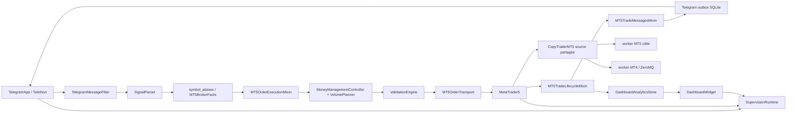

# Inventaire technique complet de NovaBOT

Date de l'inventaire : 8 août 2026  
Source de vérité : code présent dans `NOVABOT-WORKING v209`  
Nature : cartographie statique et dynamique de référence, sans modification du code

## 1. Périmètre et méthode

L'inventaire couvre l'intégralité des 298 fichiers utiles de l'arborescence fournie, en excluant seulement les artefacts Python générés (`__pycache__`, `.pyc`). Les documents existants ont servi de contrôle croisé ; les nombres, symboles, imports, écritures, branchements et contrats indiqués ci-dessous ont été vérifiés dans le code actuel.

La méthode combine :

- parcours de l'arborescence et classification par extension ;
- analyse AST des 182 fichiers Python : définitions, signatures, décorateurs, héritage, imports, constantes, signaux, fonctions asynchrones et sites de création de timers/processus ;
- lecture des implémentations et des câblages depuis `main.py` ;
- recherche des accès fichiers, SQLite, Telegram, MT5, MT4 et ZeroMQ ;
- reconstruction du graphe d'import et des principaux appels ;
- lecture des 59 modules de test et de leurs 747 scénarios ;
- contrôle par compilation et exécution de la suite réalisés sur cette même copie lors de l'analyse fonctionnelle associée.

### 1.1 Convention de comptage

| Mesure | Convention |
|---|---|
| Fichier Python applicatif | Tout `.py` hors `validation/tests`, y compris scripts, hook PyInstaller et bibliothèque QR embarquée. |
| Fonction | `FunctionDef` ou `AsyncFunctionDef` sans ancêtre de classe ; les fonctions locales sont incluses si elles ne sont pas lexicalement dans une classe. |
| Méthode | Toute fonction ayant une classe comme ancêtre ; 1 489 sont des méthodes directement déclarées dans une classe et 52 des callbacks/fonctions locales déclarés dans une méthode. |
| Signal PyQt | Affectation statique à `pyqtSignal(...)`; les connexions et émissions ne créent pas un signal supplémentaire. |
| Timer | Six objets `QTimer` récurrents et treize sites `singleShot`; le total de 19 est un nombre de sites de planification, pas nécessairement d'objets simultanés. |
| Worker/processus | Classes QThread, workers multiprocessing, thread HTTP et boucle asyncio explicitement présents. |

### 1.2 Résultats quantitatifs

| Élément | Applicatif/technique | Tests | Total |
|---|---:|---:|---:|
| Fichiers Python | 123 | 59 | 182 |
| Classes | 151 | 148 | 299 |
| Fonctions | 345 | 32 | 377 |
| Méthodes, callbacks locaux inclus | 1 541 | 1 103 | 2 644 |
| Constructeurs `__init__` | 95 | 47 | 142 |
| Fonctions/méthodes `async` | 44 | 21 | 65 |
| Propriétés `@property` | 20 | 0 | 20 |
| Dataclasses | 23 | — | 23 |
| Enums | 3 | — | 3 |
| Slots décorés `@pyqtSlot` | 10 | — | 10 |
| Signaux PyQt déclarés | 32 | — | 32 |

L'arborescence contient aussi 80 JSON de langue, 18 PNG, 7 Markdown, 5 BAT, 2 PowerShell, 1 SPEC PyInstaller, 1 ICO, 1 EA MQ4 et 1 notice texte.

## 2. Organisation des packages et points d'entrée

### 2.1 Packages

`app` est utilisé comme package namespace : plusieurs sous-répertoires (`core`, `mt5`, `telegram`, `copy_trader`, `workers`) n'ont pas de `__init__.py` mais sont importables grâce aux packages namespace Python. `app.dashboard`, `app.onboarding` et `app.supervision` possèdent une façade `__init__.py`. `validation` est un package classique ; `validation.market`, `validation.rules` et `validation.scoring` sont des sous-packages namespace.

| Package | Rôle | Principaux consommateurs | État |
|---|---|---|---|
| `app.core` | Préférences, profils, i18n, affichage, stockage atomique, analytics. | `main`, tous les modules UI. | infrastructure |
| `app.telegram` | Session Telethon, écoute, filtre, transfert, Smart, outbox. | `main`, MT5, Dashboard. | actif |
| `app.mt5` | Connexion, parsing, admission, exécution, actions, lifecycle. | `main`, Telegram, Copy Trader. | actif |
| `app.dashboard` | Projection analytique et interface statistique. | `main`. | UI |
| `app.copy_trader` | Orchestrateur de réplication MT5 vers MT5/MT4. | `main`. | actif/facultatif |
| `app.workers` | Processus source/cible et pont MT4 ZeroMQ. | Copy Trader. | infrastructure |
| `app.onboarding` | Check-list de configuration par profil. | `main`. | UI |
| `app.supervision` | Projection distante HTTP en lecture seule. | `main`, paramètres. | infrastructure/facultatif |
| `validation` | Modèles, contexte de marché, règles, scoring, historique. | pipeline d'exécution MT5. | actif/facultatif |

### 2.2 Points d'entrée

| Point d'entrée | Appel initial | Rôle |
|---|---|---|
| `main.py` | `main()` | Application PyQt, sélection/verrouillage du profil, chargement différé, fenêtre principale. |
| `main.bat` / `main.ps1` | lance Python sur `main.py` | Démarrage développeur Windows. |
| `LAUNCH_NOVABOT_MULTI_PROFILES_MENU.bat` | menu de profils | Démarrage de plusieurs profils distincts. |
| `BUILD_EXECUTABLE_NOVABOT.bat` | PyInstaller | Construction de l'exécutable et inclusion des ressources/modules. |
| `CREATE_BACKUP_NOVABOT_ZIP.bat` | PowerShell/ZIP | Sauvegarde du projet selon ses exclusions. |
| `scripts/diagnostic_supervision_distante.py` | CLI `argparse` | Diagnostic des quatre endpoints HTTP de supervision. |
| `app/mt4/INSTALLER.bat` | PowerShell | Lance l'installateur MQL-ZMQ MT4. |
| `app/mt4/INSTALLER_MQL_ZMQ_MT4.ps1` | script interactif/auto-détection | Copie le bridge MQL4, l'EA et prépare la compilation. |
| `app/workers/mt5_worker.py` | `worker_main(...)` | Boucle multiprocessing source/cible MT5. |
| `app/workers/mt4_worker.py` | `mt4_worker_main(...)` | Worker cible MT4 et serveur ZeroMQ local. |
| `rthooks/freeze_support.py` | hook PyInstaller | `multiprocessing.freeze_support()` dans l'exécutable gelé. |
| `NovaBot.spec` | PyInstaller | Décrit modules cachés, données, EA, scripts et ressources à embarquer. |

Le seul argument applicatif explicite est `--profile <nom>` ou `--profile=<nom>`, extrait par `app.core.launch_options.extract_profile_argument`. Aucun autre sous-commande CLI n'est défini dans l'application principale.

## 3. Dépendances externes réellement utilisées

| Dépendance | Usage réel | Fichiers principaux |
|---|---|---|
| PyQt5 | Fenêtres, dialogues, widgets, signaux/slots, QThread, QTimer, thèmes. | `main.py`, modules UI. |
| Telethon | Connexion Telegram, sessions, handlers NewMessage/MessageEdited/MessageDeleted, envoi et BotFather. | `app/telegram/connect_telegram.py`. |
| MetaTrader5 | Connexion terminal, faits broker, ordres, positions, historique, ticks/rates. | `app/mt5/*`, `app/workers/mt5_worker.py`. |
| cryptography/Fernet | Secrets Telegram, MT5 et Copy Trader. | Telegram, MT5, Copy Trader. |
| pyzmq | Deux sockets ZeroMQ du bridge cible MT4. | `app/workers/mt4_worker.py`. |
| SQLite (`sqlite3`) | Analytics Dashboard et outbox Telegram durable. | `dashboard_analytics.py`, `telegram_notification_outbox.py`. |
| multiprocessing | Deux workers Copy Trader, queues, freeze support. | `main.py`, Copy Trader, workers. |
| threading / HTTP stdlib | Verrous, stores, serveur de supervision. | core, supervision, validation. |
| Windows ctypes/DPAPI | AppUserModelID, élévation, détection processus, protection du token. | `main.py`, MT5, supervision, worker MT4. |
| pywinauto, import optionnel | Activation contrôlée d'Algorithmic Trading dans le terminal MT5. | `mt5_autotrading_activator.py`. |
| qrcodegen embarqué | Matrice QR de jumelage supervision. | `app/supervision/_vendor/qrcodegen.py`. |

Les imports externes standard les plus fréquents sont `os`, `json`, `datetime`, `typing`, `dataclasses`, `re`, `threading`, `math`, `time`, `ctypes`, `multiprocessing`, `sqlite3`, `subprocess`, `socket` et `urllib`.

## 4. Graphe général des composants

### 4.1 Câblage principal dans `MainWindow._wire_signals`

- `TelegramApp.new_trade_text` → `MT5App.process_external_message` ;
- détecteur Smart de `MT5App.smart_automation` → `TelegramApp.set_smart_command_detector` ;
- `MT5App.trade_outgoing_text` → `TelegramApp.send_text_to_group` ;
- `TelegramApp.notification_outbox_enqueued` → `MT5App.confirm_telegram_notification_enqueued` ;
- `TelegramApp.selected_chats_changed` → barre d'identité et `DashboardWidget.set_selected_sources` ;
- `CopyTraderMT5(..., mt5_source=self.mt5)` reçoit la façade MT5 principale pour le mode source partagé ;
- les signaux de statut alimentent la console globale et `DesktopStateObserver`.

## 5. Concurrence, workers, asyncio et timers

### 5.1 Threads, QThread et processus

| Élément | Type | Création/propriétaire | Responsabilité |
|---|---|---|---|
| `AsyncWorker` | QThread | `TelegramApp._start_worker` | Attend une coroutine exécutée sur la boucle Telegram et retransmet résultat/exception vers Qt. |
| `LoopRunner` | QThread | `TelegramApp.__init__` | Héberge `asyncio.new_event_loop()` puis `run_forever()`. |
| `MT5ConnectionAndSymbolWorker` | QThread | `MT5App._start_connection_worker` | Initialisation MT5 et collecte/écriture du cache symbole hors UI. |
| `_SnapshotWorker` | QThread | `DashboardWidget.refresh` | Construit le snapshot analytique hors thread UI. |
| worker source MT5 | `multiprocessing.Process` | `CopyTraderMT5._ensure('source')` | Poll positions/pending source et émet OPEN/CLOSE/UPDATE. Absent en mode source partagée. |
| worker cible MT5/MT4 | `multiprocessing.Process` | `CopyTraderMT5._ensure('target')` | Applique OPEN/CLOSE/UPDATE ; choisit `worker_main` ou `mt4_worker_main`. |
| thread HTTP supervision | `threading.Thread` | `SupervisionHttpTransport.start` | Exécute `ThreadingHTTPServer.serve_forever`. |
| PowerShell installateur MT4 | processus enfant | `CopyTraderMT5._launch_mt4_installer` | Lance le PS1 extrait dans un répertoire temporaire stable. |

Les workers multiprocessing communiquent par quatre queues (`q_in_src`, `q_out_src`, `q_in_tgt`, `q_out_tgt`). Les commandes sont les dataclasses `ConnectReq`, `StopReq`, `OrderCmd`; les retours utilisent `EventMsg`/tuples `(kind, payload)`. Le worker MT4 traduit ces commandes en JSON ZeroMQ.

### 5.2 Asyncio et callbacks Telegram

`TelegramApp` possède une boucle asyncio dédiée. Les coroutines de connexion, autorisation, reconnexion, création/suppression du bot, lecture des chats/messages, transfert, copie média, envoi de notifications et flush d'outbox y sont planifiées par `asyncio.run_coroutine_threadsafe`. Les handlers Telethon enregistrés par `register_listener` appellent `_handle_listener_event` pour NewMessage/MessageEdited et `_handle_deleted_listener_event` pour MessageDeleted.

### 5.3 Timers

| Timer | Intervalle | Callback | Activation |
|---|---:|---|---|
| `CopyTraderMT5.timer` | 150 ms | `_poll` | Démarre à la construction, arrêté au shutdown. |
| `CopyTraderMT5._mt4_installer_timer` | 500 ms | `_poll_mt4_installer` | Seulement pendant l'installateur. |
| `DashboardWidget._refresh_timer` | 30 s | `refresh_if_visible` | Quand l'onglet est visible. |
| `MT5App._mt5_watchdog_timer` | 2,5 s | `check_mt5_runtime_status` | Après connexion MT5. |
| `MT5App._be_timer` | 2 s | `_be_poll` | Quand le lifecycle/watchlist doit être suivi. |
| `OnboardingCoordinator._timer` | 1,5 s | `refresh` | Tant que le dialogue est ouvert. |

Treize `QTimer.singleShot` couvrent fermeture/réactivation UI Telegram, rafraîchissement Dashboard, reprise de l'assistant, auto-connexion MT5, ouverture différée de l'assistant et réapplication de l'icône/fenêtre ou de l'adaptation d'affichage.

## 6. Signaux et slots PyQt

Les 32 signaux statiques identifiés sont :

| Classe | Signaux | Rôle |
|---|---|---|
| `_SnapshotWorker` | `loaded(object)`, `failed(str)` | Retour du calcul Dashboard. |
| `DashboardWidget` | `supervision_state_changed()` | Rafraîchit la projection distante. |
| `MT5ConnectionAndSymbolWorker` | `completed(object)` | Résultat du job de connexion. |
| `MT5App` | `status_message(str,QColor)`, `update_button_signal()`, `trade_outgoing_text(object)`, `supervision_state_changed()`, `supervision_event(str,object)` | UI, publication Telegram, supervision. |
| `OnboardingCoordinator` | `profile_state_changed(bool)`, `profile_readiness_changed(int,int)` | Libellé/couleur du bouton global. |
| `OnboardingDialog` | `destination_requested(str)`, `refresh_requested()`, `skip_requested()` | Navigation de la check-list. |
| `AsyncWorker` | `finished(object)`, `errored(Exception)` | Retour coroutine → Qt. |
| `SelectTradeDialog` | `chats_loaded(list)`, `load_error(str)` | Chargement asynchrone des chats. |
| `MessagesDialog` | `messages_loaded(list)`, `load_error(str)`, `send_ok()`, `send_error(str)` | Récupération manuelle et envoi. |
| `TelegramApp` | `phone_request_signal()`, `code_request_signal(str)`, `update_button_signal(bool)`, `update_status_signal(str,QColor)`, `status_message(str,QColor)`, `selected_chats_changed()`, `supervision_state_changed()`, `telegram_reconnect_signal(str,object)`, `notification_outbox_enqueued(str)`, `new_trade_text(object)` | Authentification, état, pipeline MT5 et accusé durable. |

Les dix slots décorés appartiennent à `TelegramApp` : `send_text_to_group`, `on_create_bot_finished`, `get_phone_number_dialog`, `request_code_dialog`, `update_button_text`, `update_status`, `_handle_telegram_reconnect_event`, `on_worker_finished_ok`, `on_worker_finished_err`, `on_get_chats_finished`. Les autres slots reposent sur les connexions Qt usuelles vers des méthodes/callbacks Python.

## 7. Routes, transports et protocoles

### 7.1 Supervision HTTP

`SupervisionHttpTransport._build_handler` crée un handler strictement en lecture seule :

| Méthode/route | Réponse |
|---|---|
| `GET /supervision/health` | État du transport, sans authentification. |
| `GET /supervision/identity` | Identité de l'instance ; Bearer requis en mode privé. |
| `GET /supervision/snapshot` | Projection courante ; Bearer requis en mode privé. |
| `GET /supervision/events?after=N` | Événements ordonnés après N. |

Toutes les méthodes HEAD/POST/PUT/PATCH/DELETE/OPTIONS/TRACE/CONNECT retournent 405. Une route inconnue retourne 404. Le transport refuse une adresse non locale, une adresse non affectée au PC et le mode privé sans authentification explicite.

### 7.2 Telegram

Les transports sont Telethon `TelegramClient` et ses conversations BotFather. Les interactions réelles couvrent : connexion/autorisation, dialogues, messages, fichiers, édition du message destination, transfert/copie, profil, groupe, participants/admin, événements nouveaux/édités/supprimés. Aucun webhook Telegram n'est présent.

### 7.3 MT5

`MT5BrokerFacts` est la frontière de lecture (`positions_get`, `orders_get`, `terminal_info`, `account_info`, `symbol_info`, `symbol_info_tick`, `copy_rates_from_pos`, `symbols_get`, historiques). `MT5ActionGateway.send_order` est la frontière d'action et délègue à `MetaTrader5.order_send`. `MT5OrderTransport` et `MT5PositionTransport` spécialisent les requêtes sans déplacer la décision métier dans le gateway.

### 7.4 MT4/ZeroMQ

Le worker Python bind `tcp://127.0.0.1:6001` pour les commandes et `tcp://127.0.0.1:6002` pour les événements. L'EA `NovaBot_MT4_Slave_ZMQ.mq4` s'y connecte, envoie READY/HEARTBEAT/inventaire et exécute les commandes OPEN, CLOSE, DELETE_PENDING et modifications. Le fichier temporaire `%TEMP%/NovaBot_MT4_bridge_6002.json` décrit le propriétaire du bridge pour récupérer un ancien worker invisible sans tuer un processus tiers identifié.

## 8. Inventaire fichier par fichier

Dans les tableaux suivants, « symboles » énumère les définitions publiques ou structurantes. Les méthodes privées et callbacks sont détaillés dans l'annexe des classes. « Appelé par » provient du graphe d'import et du câblage observé, pas d'une simple ressemblance de nom.

### 8.1 Racine, build et scripts

| Fichier | Rôle, symboles, dépendances et effets | Appelé par / état |
|---|---|---|
| `main.py` | `ProfileDialog`, `MainWindow`; démarrage, sélection/verrou profil, chargement différé, shell, tabs, signaux, onboarding, supervision. PyQt5, multiprocessing, `app.core`. | `main.bat`, exécutable ; **actif**. |
| `main.bat` | Lance le Python du projet avec les arguments reçus. | utilisateur ; **infrastructure**. |
| `main.ps1` | Variante PowerShell de lancement. | utilisateur ; **infrastructure**. |
| `LAUNCH_NOVABOT_MULTI_PROFILES_MENU.bat` | Menu de sélection/lancement multi-profils. | utilisateur ; **infrastructure**. |
| `BUILD_EXECUTABLE_NOVABOT.bat` | Prépare l'environnement, nettoie les modules conflictuels et lance PyInstaller. | build ; **infrastructure**. |
| `CREATE_BACKUP_NOVABOT_ZIP.bat` | Construit une archive en excluant caches et raccourcis. | maintenance ; **infrastructure**. |
| `NovaBot.spec` | Datas PyInstaller : langues, ressources, MT4, hook et hidden imports. | build ; **infrastructure**. |
| `rthooks/freeze_support.py` | Appelle `multiprocessing.freeze_support`. | runtime gelé PyInstaller ; **infrastructure**. |
| `scripts/diagnostic_supervision_distante.py` | `request_json`, `diagnose`, `main`; client CLI GET avec token optionnel. | lancement manuel ; **outil autonome**. |
| `README.md`, `README.fr.md` | Présentation utilisateur, non exécutée. | documentation. |
| `NOVABOT_USER_GUIDE_2026-08-05_*.md` | Guides utilisateur FR/EN. | documentation. |
| `COMPLETE_FUNCTIONAL_ANALYSIS_NOVABOT_2026-08-05_*.md` | Analyses historiques, non importées. | documentation. |

### 8.2 `app.core`

| Fichier | Rôle et symboles | Imports/données | Appelé par / état |
|---|---|---|---|
| `app/core/about_dialog.py` | `AboutNovaBOTDialog`, `create_about_button`, `show_about_dialog`; métadonnées version/build/GitHub/licences et thème. | PyQt5, préférences, logos. | Tous les headers ; **UI**. |
| `app/core/app_preferences.py` | 20 fonctions de langue, thème, affichage, typographie et démarrage. Cache de détection langue. | `config.json`, `app_startup_settings.json`, `atomic_json`. | `main` et modules UI ; **infrastructure**. |
| `app/core/atomic_json.py` | `write_json_atomic`; fichier temporaire, `fsync`, remplacement atomique. | JSON, tempfile, OS. | repositories/stores ; **infrastructure**. |
| `app/core/dashboard_analytics.py` | `DashboardAnalyticsStore`, singleton `get_dashboard_analytics_store`; schéma SQLite, décisions filtre/parser/exécution/terminal. | `dashboard_analytics.sqlite3`, verrou global `_STORES_LOCK`. | Telegram, MT5, Dashboard ; **actif**. |
| `app/core/dashboard_statistics.py` | `DashboardStatisticsService`; périodes, agrégations, scoring, étoiles, totaux. | SQLite/JSON/math. | Dashboard ; **actif**. |
| `app/core/display_adaptation.py` | `DisplayAdaptationController`, `apply_saved_display_mode`; filtre d'événements écran/DPI. | PyQt5, display policy. | `main` ; **UI/infrastructure**. |
| `app/core/display_policy.py` | dataclass immuable `DisplayPlan`, choix automatique et construction d'un plan borné. | préférences. | display adaptation ; **policy**. |
| `app/core/documentation.py` | `DocumentationDialog` et helpers d'icône/options documentées. | domaine i18n `documentation`, PNG. | filtres/MM ; **UI**. |
| `app/core/i18n.py` | Charge les huit domaines JSON, `tr`, `tr_domain`, langue courante. | `language/<lang>/*.json`. | transversal ; **infrastructure**. |
| `app/core/launch_options.py` | `extract_profile_argument`. | aucun effet de bord. | `main` et tests ; **actif**. |
| `app/core/profile_json_store.py` | `ProfileJsonDocumentStore`; lecture stricte/tolérante et écriture atomique. | fichier reçu par chemin. | repositories ; **infrastructure**. |
| `app/core/profile_manager.py` | 37 fonctions : création, chemins, import/export ZIP sûr, liste, activation, renommage, suppression, verrou PID. | `.novabot/config.json`, arborescence profiles. | `main`, tous les modules profil ; **actif**. |
| `app/core/startup_settings_dialog.py` | `StartupSettingsDialog`; démarrage automatique, affichage, supervision, token/QR/port. | préférences, supervision, PyQt5. | headers ; **UI**. |
| `app/core/tab_bar_adaptation.py` | `configure_resilient_tab_widget`, `refresh_tab_widget_metrics`. | Qt widgets passés en argument. | `main` ; **UI**. |
| `app/core/typography.py` | Facteur de taille, application au `QApplication` et rafraîchissement propriétaires. | préférences. | UI globale ; **infrastructure**. |

### 8.3 Dashboard

| Fichier | Rôle et symboles | Dépendances/effets | Appelé par / état |
|---|---|---|---|
| `app/dashboard/__init__.py` | Réexporte `DashboardWidget`. | `.dashboard`. | `main` ; **façade**. |
| `app/dashboard/dashboard.py` | `_SnapshotWorker`, `_SortableItem`, `DashboardWidget`; tableau sources, détails, période, reset non destructif, thème. | analytics/statistics, QThread/QTimer. | `MainWindow`; **UI active**. |

### 8.4 Assistant de configuration

| Fichier | Rôle et symboles | Persistance/interactions | État |
|---|---|---|---|
| `app/onboarding/__init__.py` | Réexporte repository/service et dataclasses. | façade. | infrastructure. |
| `app/onboarding/repository.py` | `OnboardingRepository`; document versionné, start/verified/complete/skipped/resume. | `data/onboarding.json`, écrit atomiquement. | coordinator/service ; **repository actif**. |
| `app/onboarding/service.py` | dataclasses `SetupStep`, `StepState`; `OnboardingService`; huit contrôles réels Telegram/MT5/MM. | modules injectés, settings profil. | coordinator ; **service actif**. |
| `app/onboarding/coordinator.py` | `OnboardingCoordinator`; dialogue, timer, navigation et signaux de progression. | service, callback `MainWindow.open_setup_destination`. | `main`; **controller UI**. |
| `app/onboarding/dialog.py` | `OnboardingDialog`; lignes réutilisables, statuts, boutons et style. | PyQt5/i18n. | coordinator ; **UI**. |

### 8.5 Copy Trader et workers

| Fichier | Rôle et symboles | Persistance/protocoles | Appelé par / état |
|---|---|---|---|
| `app/copy_trader/copy_trader_mt5.py` | dataclasses `ConnInfo`, `AppState`; `CopyTraderMT5`; UI, découverte, chiffrement, workers, synchronisation initiale, mapping, réplication et installer MT4. | settings/map JSON, logs, queues, processus. | `main`; **actif/facultatif**. |
| `app/workers/mt5_worker.py` | `ConnectReq`, `StopReq`, `OrderCmd`, `EventMsg`; fonctions connexion, alias, OPEN/CLOSE/MODIFY, inventaire et poll. | API MetaTrader5, queues multiprocessing. | Copy Trader ; **worker actif**. |
| `app/workers/mt4_worker.py` | `MT4TerminalLauncher`; récupération port, journal rotatif, protocole JSON/ZeroMQ, `mt4_worker_main`. | ports 6001/6002, owner temp, `mt4_worker.log`. | Copy Trader cible MT4 ; **worker actif**. |
| `app/mt4/INSTALLER.bat` | Lance le PS1. | Windows. | bouton Copy Trader ou manuel. |
| `app/mt4/INSTALLER_MQL_ZMQ_MT4.ps1` | Détecte les dossiers MT4, installe mql-zmq et copie l'EA. | dossiers de données MT4. | bouton Copy Trader ; **outil actif**. |
| `app/mt4/MQL4/Experts/NovaBot_MT4_Slave_ZMQ.mq4` | EA cible : READY/HEARTBEAT/inventaire, alias/volume, actions de trading. | mql-zmq, MT4. | worker MT4 ; **runtime externe actif**. |
| `app/mt4/THIRD_PARTY_NOTICES.md` | Licence/attribution mql-zmq. | aucune exécution. | conformité. |

### 8.6 MetaTrader 5 : connexion, admission et transport

| Fichier | Rôle et symboles | Dépendances/persistance | Utilisé par / état |
|---|---|---|---|
| `app/mt5/connect_metatrader_mt5.py` | `ConnectionDialog`, `MT5ConnectionAndSymbolWorker`, `MT5App`; façade UI et orchestrateur : connexion, settings, snapshots, contexte Telegram, symboles, alias, Smart, lifecycle. | MetaTrader5, Fernet, PyQt5; settings/logs/secrets profil. | `main`; **façade active**. |
| `app/mt5/mt5_composition.py` | `MT5DomainMixins`, composition ordonnée de huit mixins. | exécution, actions, smart close, monitoring, lifecycle, classifier, messages, math. | parent de `MT5App`; **infrastructure**. |
| `app/mt5/mt5_runtime_state.py` | `MT5RuntimeState`; propriétés stables sur lifecycle et corrélations Telegram. | `LifecycleRuntimeState`, `TelegramCorrelationState`. | `MT5App`; **propriétaire d'état**. |
| `app/mt5/mt5_startup.py` | `_initialize`, `run_mt5_startup_job`; initialisation terminal et cache symboles. | `symbol_info_store`. | worker QThread de connexion ; **service**. |
| `app/mt5/metatrader_discovery.py` | 23 fonctions; recherche registre/disques, validation MT4/MT5, cache global protégé. | Windows, pathlib, threading. | MT5 et Copy Trader ; **service centralisé**. |
| `app/mt5/metatrader_server_discovery.py` | Catalogue central, extraction binaire `.srv`, normalisation et collecte. | `DEFAULT_SERVER_CATALOG`, dossiers MetaQuotes. | MT5 et Copy Trader ; **service centralisé**. |
| `app/mt5/mt5_broker_facts.py` | `MT5BrokerFacts`; toutes les lectures broker et retry tick utilisable. | module MetaTrader5 injecté. | validation, exécution, lifecycle, actions ; **gateway lecture**. |
| `app/mt5/mt5_action_gateway.py` | `MT5ActionGateway.send_order`. | `order_send`. | transports ordre/position ; **gateway action**. |
| `app/mt5/mt5_order_transport.py` | `MT5OrderTransport`; modes de filling, requêtes MARKET/LIMIT et repli filling. | action gateway, i18n. | mixin exécution ; **transport**. |
| `app/mt5/mt5_position_transport.py` | `MT5PositionTransport.send`; frontière transparente de requête position. | action gateway. | actions/smart close ; **transport**. |
| `app/mt5/mt5_protocol.py` | Constante retcode `TRADE_RETCODE_CLIENT_DISABLES_AT`. | aucune. | présentateur de messages ; **contrat**. |
| `app/mt5/execution_admission_policy.py` | `ExecutionAdmissionPolicy`; géométrie, famille d'actif, tolérances auto/points, zone réelle. | aucun I/O. | exécution et validation ; **policy active**. |
| `app/mt5/execution_order_policy.py` | `ExecutionOrderPolicy.decide`; décision historique de conversion MARKET/LIMIT selon slippage. | adaptateur `order_types`. | importé par tests seulement dans le code observé ; **compatibilité/test probable**. |
| `app/mt5/money_management.py` | `MoneyManagementController`, `default_mm_settings`; capital, risque, volume, entrée fractionnée, TP offset, UI des cinq onglets. | repository MM, broker facts, PyQt5. | `MT5App`; **controller actif**. |
| `app/mt5/money_management_settings_repository.py` | `MoneyManagementSettingsRepository`; préserve document partagé, settings MM et sources. | `ProfileJsonDocumentStore`, `SelectedChatsStore`. | MM et onboarding ; **repository**. |
| `app/mt5/money_management_volume_planner.py` | `MoneyManagementVolumePlanner`; fixed total, zone split, risque, réduction broker-alignée. | fonctions numériques injectées. | exécution ; **service actif**. |
| `app/mt5/mt5_order_execution.py` | `MT5OrderExecutionMixin`; pipeline complet depuis params jusqu'à transport et tracking. | admission, MM, validation, alias/facts/transport. | `MT5App`; **moteur actif**. |
| `app/mt5/mt5_autotrading_activator.py` | `MT5AutoTradingActivator`; contrôle UIA du terminal, redémarrage contrôlé, vérification. | pywinauto optionnel, subprocess/threading. | préflight exécution ; **service facultatif**. |
| `app/mt5/trade_numeric.py` | `TradeNumeric`; arrondi, clamp/align volume, volume par risque, prix. | pur. | math et planner ; **service numérique**. |
| `app/mt5/mt5_trade_math.py` | `MT5TradeMathMixin`; familles crypto/indices, spread, pips, euros, normalisation. | `TradeNumeric`. | `MT5App`; **mixin actif**. |
| `app/mt5/parser_order_types.py` | `ParserOrderTypes`; mappe direction/qualifier vers constantes MT5. | module MT5 injecté. | parser ; **adapter**. |
| `app/mt5/parser_symbol_catalog.py` | `ParserSymbolCatalog`; cache mtime des noms broker. | `symbol_info.json`. | parser ; **store/cache**. |
| `app/mt5/signal_parser.py` | `SignalParser`; parser primaire, parser générique, diagnostic, multi-instruction, zones et STOP/LIMIT. | regex, order types/catalogue. | MT5 et correction Telegram ; **service actif**. |
| `app/mt5/symbol_aliases.py` | Constantes familles + 20 fonctions de résolution/scoring/génération. | JSON, faits symboles MT5. | `MT5App`, Copy Trader ; **service actif**. |
| `app/mt5/symbol_info_store.py` | Huit fonctions; collecte stable, comparaison hors champs volatils, canonical/legacy. | `mt5_sessions/symbol_info.json`. | startup/parser ; **cache persistant**. |

### 8.7 MetaTrader 5 : positions, Smart et lifecycle

| Fichier | Rôle et symboles | Dépendances/état | Utilisé par / état |
|---|---|---|---|
| `app/mt5/mt5_position_actions.py` | `MT5PositionActionsMixin`; sécuriser, BE, modifier SL/TP positions et pending, clôture totale/partielle/progressive. | facts/transport, MetaTrader5, lifecycle state. | `MT5App`, Smart/lifecycle ; **actif**. |
| `app/mt5/mt5_smart_close.py` | `MT5SmartCloseMixin`; résolution du contexte, collecte exacte, clôture positions + annulation pending. | facts/transport, historique. | Smart gateway ; **actif**. |
| `app/mt5/smart_action_gateway.py` | `SmartActionGateway`; façade des huit familles d'actions. | `MT5App` injectée. | moteur Smart ; **gateway actif**. |
| `app/mt5/smart_command_executor.py` | `SmartCommandExecutor`; dispatch d'une commande validée vers le moteur. | Smart engine. | Smart engine ; **service actif**. |
| `app/mt5/trade_protection_policy.py` | `TradeProtectionPolicy.secure_on_pips`; décision pure BUY/SELL. | aucun I/O. | monitoring ; **policy active**. |
| `app/mt5/mt5_trade_monitoring.py` | `MT5TradeMonitoringMixin`; readiness, doublons, ticks TP, expiration LIMIT, secure-on-pips, poll. | facts, protection policy. | timer lifecycle ; **actif**. |
| `app/mt5/mt5_trade_classifier.py` | `MT5TradeClassifierMixin`; collecte historique et classification TP/SL/Smart/manuel/inconnu. | historique/ticks MT5. | lifecycle ; **actif**. |
| `app/mt5/mt5_trade_lifecycle.py` | `MT5TradeLifecycleMixin`; 67 méthodes de tracking, transitions, BE, fractionnement, pending, TP progressifs et fin. | runtime state, facts, classifier, messages, stores. | timer `_be_timer`; **moteur actif**. |
| `app/mt5/mt5_trade_messages.py` | `MT5TradeMessagesMixin` et sept façades; rend notifications exécution/lifecycle sans lecture MT5. | i18n/retcodes. | exécution/actions/lifecycle ; **présentateur actif**. |
| `app/mt5/lifecycle_runtime_state.py` | `LifecycleRuntimeState`; conteneurs watchlist/batches, register/remove. | mémoire mutable. | `MT5RuntimeState`; **propriétaire état**. |
| `app/mt5/lifecycle_watchlist_store.py` | `LifecycleWatchlistStore`; payload versionné. | `be_watchlist.json`, atomic JSON. | lifecycle ; **store actif**. |
| `app/mt5/lifecycle_delivery_acknowledgement.py` | `LifecycleDeliveryAcknowledgement.confirm`; marque durable seulement après ACK outbox. | watchlist + callback save. | `MT5App`; **service actif**. |
| `app/mt5/lifecycle_terminal_event.py` | dataclass immuable `LifecycleTerminalEvent`. | datetime/typing. | transition terminale ; **modèle**. |
| `app/mt5/lifecycle_terminal_transition.py` | `LifecycleTerminalTransition`; idempotence et `delivery_id` stable. | hash, événement. | publisher ; **service actif**. |
| `app/mt5/lifecycle_terminal_publisher.py` | `LifecycleTerminalProjectionPublisher`, `LifecycleTerminalPublisher`; projection/archivage/republication. | transition, owner MT5. | lifecycle ; **service actif**. |
| `app/mt5/dashboard_terminal_evidence.py` | `DashboardTerminalEvidenceCollector`; collecte deals/orders/account du batch. | facts broker. | archiver ; **service actif**. |
| `app/mt5/dashboard_terminal_archiver.py` | `DashboardTerminalArchiver`; transmet preuve confirmée au Dashboard store. | evidence collector. | lifecycle ; **service actif**. |
| `app/mt5/progressive_tp.py` | presets, normalisation, validation 100 %, calcul volume résiduel. | Decimal/copy. | MM/lifecycle ; **policy active**. |
| `app/mt5/telegram_signal_correction.py` | dataclass `SignalCorrectionResult`, `TelegramSignalCorrectionService`; modifie SL/TP ou ouvre TP manquant sans nouveau batch. | owner MT5, API MT5. | pipeline message édité ; **service actif**. |
| `app/mt5/trade_log_store.py` | `TradeLogStore`; append et dernier symbole. | `trade_log.json`. | `MT5App`; **store actif**. |

### 8.8 Telegram

| Fichier | Rôle et symboles | Persistance/interactions | Utilisé par / état |
|---|---|---|---|
| `app/telegram/connect_telegram.py` | neuf classes dont `TelegramApp`; connexion, dialogues, handlers, filtre, bot/groupe, transfert/copie, outbox et bridge MT5. | Telethon, Fernet, asyncio/QThread, nombreux stores profil. | `main`; **façade active**. |
| `app/telegram/bot_admin_promotion.py` | `BotAdminConfirmationError`, `_wait_for_state`, `promote_bot_admin_when_ready`. | coroutines, retries. | création bot ; **service actif**. |
| `app/telegram/selected_chats_store.py` | `SelectedChatsStore.load/save`. | `selected_chats.json`. | Telegram/MM ; **store actif**. |
| `app/telegram/telegram_profile_settings_repository.py` | `TelegramProfileSettingsRepository`; lecture/update document partagé. | `app_settings.json`. | Telegram ; **repository**. |
| `app/telegram/telegram_filter_contracts.py` | dataclass immuable `FilterDecision`. | aucun I/O. | filtre/policy ; **modèle**. |
| `app/telegram/telegram_filter_policy.py` | `TelegramFilterPolicy`; délégation stable vers filtre. | filtre injecté. | pipeline listener ; **policy**. |
| `app/telegram/telegram_filter.py` | defaults/normalisation, `TelegramFilterStore`, `TelegramMessageFilter`; contenu, structure, Smart, doublons. | settings/processed JSON et log. | listener/dialogue ; **moteur actif**. |
| `app/telegram/telegram_filter_dialog.py` | `FilterRuleEditor`, `TelegramFilterDialog`; mode global/par source. | PyQt5/documentation. | `TelegramApp`; **UI**. |
| `app/telegram/telegram_forward_map_store.py` | `TelegramForwardMapStore`; restaure formats root/legacy. | `telegram_forward_map.json`. | transfert/réponses ; **store actif**. |
| `app/telegram/telegram_deleted_message_audit.py` | `TelegramDeletedMessageAudit`; cache messages, empreinte, suppression/recréation, log borné. | cache JSON + log. | handlers Telegram ; **audit actif**. |
| `app/telegram/telegram_notification_outbox.py` | six classes; store SQLite, leasing, ordre par batch, retry, dead-letter, gestion manuelle. | `telegram_notification_outbox.sqlite3`. | publications MT5→Telegram ; **infrastructure active**. |
| `app/telegram/telegram_reconnect.py` | dataclass `TelegramReconnectState`, calendrier et format durée. | mémoire. | watchdog Telegram ; **state/policy actif**. |
| `app/telegram/smart_automation_persistence.py` | `SmartAutomationPersistence`; settings/dictionnaire/log. | app settings, dictionary JSON, `smart_command.log`. | Smart engine ; **repository**. |
| `app/telegram/smart_command_detector.py` | `SmartCommandDetector.detect`; façade sans action MT5. | engine injecté. | filtre/Telegram ; **service actif**. |
| `app/telegram/smart_batch_context_resolver.py` | `SmartBatchContextResolver`; sélection batch/source/sens. | watchlist du moteur. | Smart engine ; **service actif**. |
| `app/telegram/smart_automations.py` | `SmartAutomationEngine`; dictionnaire, UI, détection, validation, contexte, dispatch et logs. | gateway/executor/persistence. | `MT5App`; **moteur actif**. |
| `app/telegram/telegram_correlation_state.py` | `TelegramCorrelationState`; six dictionnaires partagés + contexte courant. | mémoire. | runtime MT5 ; **propriétaire état**. |
| `app/telegram/telegram_batch_correlation_service.py` | `TelegramBatchCorrelationService`; enregistrement message/batch, alias, replies, cleanup. | correlation state/watchlist. | `MT5App`; **service actif**. |

### 8.9 Supervision

| Fichier | Rôle et symboles | État/interaction |
|---|---|---|
| `app/supervision/__init__.py` | Réexporte identity, events, projection, runtime, observer, service, snapshot et transport. | façade importée par `main`; **actif**. |
| `app/supervision/identity.py` | dataclass `DesktopInstanceIdentity`, `create`, `to_dict`. | état immuable d'instance. |
| `app/supervision/events.py` | dataclasses `SupervisionEvent`, `SupervisionEventBatch`; `SupervisionEventStream` borné et thread-safe. | propriétaire du flux mémoire. |
| `app/supervision/projection.py` | `SupervisionProjection`; copies défensives, révision, sections. | propriétaire projection mémoire. |
| `app/supervision/snapshot.py` | dataclass `SupervisionSnapshot`, `SupervisionSnapshotService`. | vue sérialisable. |
| `app/supervision/runtime.py` | `SupervisionRuntime`; compose identity/projection/events/snapshot, n'émet que sur changement. | `main`; **runtime actif**. |
| `app/supervision/observer.py` | `DesktopStateObserver`; observe Telegram/MT5/Dashboard/config, masque login, classe publications. | `main`; **observateur actif**. |
| `app/supervision/notifications.py` | Normalisation et `classify_publication`. | observer ; **policy de projection**. |
| `app/supervision/config.py` | defaults, normalisation, `SupervisionSettingsStore`. | `supervision/settings.json`; **store**. |
| `app/supervision/security.py` | DPAPI Windows, `SupervisionTokenStore`, empreinte SHA-256. | `supervision/token.protected`; **sécurité**. |
| `app/supervision/network.py` | Détection IPv4 privée affectée et prochain port local. | sockets/IP ; **service**. |
| `app/supervision/pairing.py` | URI `novabot://pair`, parsing et matrice QR. | qrcodegen/token fingerprint ; **service**. |
| `app/supervision/service.py` | `SupervisionTransportService`; apply/restart/fallback/diagnostics/token. | transport/settings/token ; **service actif**. |
| `app/supervision/transport.py` | `_ReadOnlyHttpServer`, `SupervisionHttpTransport`, handler HTTP imbriqué. | thread HTTP, quatre routes GET ; **transport actif facultatif**. |
| `app/supervision/_vendor/qrcodegen.py` | `QrCode`, `QrSegment`, `_BitBuffer`, `DataTooLongError`; encodeur QR tiers. | pairing ; **bibliothèque embarquée active**. |
| `app/supervision/_vendor/__init__.py` | Marque la zone vendored comme package ; aucune définition. | import QR ; **infrastructure**. |
| `app/supervision/_vendor/NOTICE.txt` | Notice du composant QR. | conformité. |

### 8.10 Validation

| Fichier | Rôle et symboles | Données/interactions | État |
|---|---|---|---|
| `validation/__init__.py` | Réexporte config, engine et history store. | façade utilisée par MT5. | actif. |
| `validation/config.py` | dataclasses `SymbolValidationConfig`, `ValidationConfig`, `default_config`; seuils par famille/mode. | définit `validation_history.csv`. | configuration active. |
| `validation/models.py` | enums `TradeSide`, `DecisionStatus`, `RuleSeverity`; dataclasses `Signal`, `MarketSnapshot`, `RuleResult`, `ValidationDecision`. | modèles purs. | actif. |
| `validation/market/market_context.py` | `MarketContext`; facts broker, EMA, ATR, snapshot/cache injecté. | `MT5BrokerFacts`. | service actif. |
| `validation/rules/base_rule.py` | `BaseRule(ABC)` et contrat abstrait `evaluate`. | base. | infrastructure. |
| `validation/rules/broker_metadata_rule.py` | `BrokerMetadataRule`; point/digits/volume min/max/step et données indispensables. | snapshot/config. | règle active. |
| `validation/rules/geometry_rule.py` | `SignalGeometryRule`; direction SL/TP/entrée. | admission policy. | règle active. |
| `validation/rules/spread_rule.py` | `SpreadRule`; plafond absolu/relatif selon famille et mode. | config/snapshot. | règle active. |
| `validation/rules/trend_rule.py` | `TrendRule`; EMA20/EMA50 et mode. | snapshot. | règle active. |
| `validation/rules/atr_rule.py` | `ATRRule`; distance TP1/ATR et données manquantes. | snapshot. | règle active. |
| `validation/rules/volume_rule.py` | `VolumeRule`; bornes et alignement volume broker. | signal/snapshot. | règle active. |
| `validation/rules/risk_rule.py` | `RiskRule`; risque calculé contre budget. | signal. | règle active. |
| `validation/rule_evaluator.py` | `ValidationRuleEvaluator`; applique chaque règle et conserve le contrat d'exception fail-open prévu. | règles. | service actif. |
| `validation/scoring/decision.py` | `DecisionManager`; transforme score/résultats en ALLOW/REDUCE/BLOCK. | config/models. | service actif. |
| `validation/validator.py` | `ValidationEngine`; ordre des règles, normalisation, snapshot, score borné, décision. | tous les éléments ci-dessus. | moteur actif si option. |
| `validation/history_store.py` | `ValidationHistoryStore`; sérialisation JSON de détails et append CSV thread-safe. | `logs/validation_history.csv`. | store actif fail-open. |

### 8.11 Langues et ressources

Les 80 JSON sont organisés en dix langues (`ar`, `de`, `en`, `es`, `fr`, `it`, `ja`, `pt`, `ru`, `zh`) et huit domaines (`main`, `telegram`, `mt5`, `copy_mt5`, `dashboard`, `documentation`, `notifications`, `onboarding`). `app.core.i18n` lit ces fichiers en mémoire ; aucun module ne les modifie à l'exécution.

| Ressource | Consommateur |
|---|---|
| `ressources/novabotdark640x640.png`, `novabotlight640x640.png`, `logo_novabot.png` | headers et About. |
| `ressources/novabot.ico` | QApplication/fenêtres/exécutable. |
| `ressources/preferences/gear.png` | bouton Paramètres. |
| `ressources/preferences/profile_status.png` | état/configuration du profil. |
| `ressources/documentation/question_mark.png`, `dictionary.png` | aide contextuelle et dictionnaire Smart. |
| `ressources/flags/*.png` | sélecteur de langue. |

## 9. Inventaire des classes, fonctions et méthodes

Cette section donne le nom complet, l'héritage, l'état significatif et la responsabilité de chaque groupe de méthodes de production. Les helpers de rendu ou normalisation sont regroupés lorsqu'ils ont la même responsabilité ; leurs noms restent tous cités.

### 9.1 Classes UI et orchestration

#### `main.ProfileDialog(QtWidgets.QDialog)`

État : combo profils/langues/thèmes, résultat `selected_profile`. Dépend de `profile_manager`, i18n et préférences.

- `__init__` construit et traduit le dialogue ; `_build_profile_selector`, `_build_language_selector`, `_build_profile_theme_selector`, `_build_profile_actions` créent les sections.
- `on_language_preview_changed`, `retranslate_ui`, `on_theme_changed`, `on_theme_toggled`, `apply_modern_palette`, `apply_modern_stylesheet` gèrent la présentation.
- `refresh_profiles`, `create_new_profile`, `delete_selected_profile`, `export_selected_profile`, `_select_profile_export_destination`, `import_profile_archive`, `_apply_imported_profile`, `_profile_import_message`, `accept_profile` exécutent les opérations profil et valident le choix.

#### `main.MainWindow(QtWidgets.QMainWindow)`

État : instances `telegram`, `mt5`, `dashboard`, `copy_trader`, supervision, onboarding, tabs, barre d'identité.

- construction : `__init__`, `_configure_main_window`, `_build_main_shell`, `_add_telegram_tab`, `_add_mt5_tab`, `_add_dashboard_tab`, `_configure_copy_trader_processes`, `_add_copy_trader_tab`, `_make_placeholder` ;
- supervision : `_initialize_supervision`, `apply_supervision_settings`, `supervision_diagnostics`, `regenerate_supervision_token`, `supervision_token_for_local_copy` ;
- identité/UI : `_apply_identity_bar_style`, `refresh_typography`, `_refresh_main_tab_metrics`, `_identity_listening_text`, `_identity_mt5_text`, `_identity_mt5_login`, `_identity_mt5_server`, `refresh_identity_bar`, `_refresh_visible_module` ;
- câblage : `_attach_status_signal`, `_wire_signals`, `_sync_dashboard_sources`, `_select_module_tab` ;
- onboarding : `_initialize_onboarding`, `show_onboarding`, `_update_onboarding_button_label`, `_update_onboarding_button_readiness`, `open_setup_destination` ;
- arrêt : `_log`, `closeEvent` arrête workers, timers, supervision et libère le profil.

Fonctions racine : `init_language` initialise i18n ; `_copytrader_available` teste la plateforme/dépendance ; `load_modules_after_profile_selection` importe les modules lourds ; `_configure_process_startup` prépare multiprocessing ; `_create_desktop_application` crée QApplication ; `_profile_launch_error` affiche les erreurs ; `_select_and_lock_profile` résout et verrouille ; `_show_main_window` instancie ; `main` orchestre.

#### `app.dashboard.dashboard`

- `_SnapshotWorker(QtCore.QThread)` possède `service`, `period`, `selected_sources`; `run` appelle `build_snapshot`, émet `loaded` ou `failed`.
- `_SortableItem` redéfinit `__lt__` pour le tri numérique.
- `DashboardWidget` possède store/service/snapshot/worker/timer/sources. `__init__`, `_build_ui`, `showEvent`, `hideEvent`, `refresh_if_visible`, `set_selected_sources`, `refresh`, `_worker_finished`, `_apply_snapshot`, `_populate_table`, `_show_selected_details`, `_clear_details`, `_show_error`, `_confirm_reset_source`, `_show_methodology`, `open_settings_dialog`, `open_about_dialog`, `refresh_typography`, `_dashboard_logo_path`, `_update_dashboard_logo`, `apply_theme` couvrent le cycle UI ; `_number`, `_money`, `_percent`, `_factor`, `_stars`, `_duration` formatent les valeurs.

#### About, documentation, affichage et paramètres

- `AboutNovaBOTDialog(QDialog)` : `__init__`, `_build_ui`, `_apply_theme`; helpers `_resource_path`, `_logo_path`, `_theme_colors`, `create_about_button`, `show_about_dialog`.
- `DocumentationDialog(QDialog)` : `__init__`, `_fit_to_documentation`; helpers `documentation_translation_key`, `documentation_text`, `documentation_icon_path`, `open_documentation_dialog`, `make_documentation_icon`, `make_documented_option`.
- `StartupSettingsDialog(QDialog)` : construction/chargement via `__init__`, `_build_ui`, `_load_values`, `_update_display_description`; supervision via `_main_window`, `_update_supervision_controls`, `_on_supervision_mode_changed`, `_autofill_private_supervision_address`, `_refresh_supervision_diagnostics`, `_copy_supervision_token`, `_regenerate_supervision_token`, `_show_supervision_qr`, `_qr_pixmap`, `_offer_alternative_supervision_port`; `accept` persiste.
- `DisplayAdaptationController(QObject)` : propriété `mode`; `apply_saved_mode`, `set_mode`, `_apply_current_mode`, `_screen_scale`, `_current_screen`, connexions/déconnexions écran, callbacks métriques, `_apply_if_windowed`, `eventFilter`. `apply_saved_display_mode` est la façade.
- dataclass immuable `DisplayPlan` contient la géométrie/facteur du plan ; `choose_automatic_display_mode` et `build_display_plan` décident sans effet de bord.

#### Assistant

- `OnboardingRepository` possède le chemin JSON : `for_profile`, `exists`, `initialize_new_profile`, `load`, `save`, `ensure_started`, `mark_verified`, `mark_complete`, `skip_guided`, `resume_guided`, `should_auto_open`; `_now_iso` et `_default_document` construisent les valeurs.
- dataclasses immuables `SetupStep` et `StepState` décrivent une étape et son état.
- `OnboardingService` possède repository + modules injectés. `_safe`, les huit méthodes `_telegram_api_ready`, `_telegram_connected`, `_telegram_bot_group_ready`, `_telegram_sources_ready`, `_telegram_filter_ready`, `_mt5_connected`, `_money_management_settings_path`, `_money_management_ready`, `_telegram_listening_ready` lisent l'état ; `readiness`, `refresh`, `progress` agrègent/persistent.
- `OnboardingCoordinator(QObject)` possède dialogue et timer : `_wire_existing_state_signals`, `should_auto_open`, `show`, `refresh`, `_navigate`, `_skip`.
- `OnboardingDialog(QDialog)` possède les lignes : `_build_ui`, `_apply_style`, `_ensure_row`, `update_states`.

### 9.2 Classes MT5

#### `MT5App(MT5DomainMixins, QWidget)`

Façade et propriétaire UI. Son héritage effectif, fixé par `MT5DomainMixins`, est : `MT5OrderExecutionMixin`, `MT5PositionActionsMixin`, `MT5SmartCloseMixin`, `MT5TradeMonitoringMixin`, `MT5TradeLifecycleMixin`, `MT5TradeClassifierMixin`, `MT5TradeMessagesMixin`, `MT5TradeMathMixin`.

État significatif créé par `__init__`, `_initialize_mt5_state`, `_initialize_mt5_runtime_timers`, `_initialize_batch_context_state` : connexion MT5, `MT5RuntimeState`, parser, correction Telegram, validation, MM, Smart engine, caches symboles/alias, watchlist, timers, workers et widgets.

Responsabilités de ses méthodes directes :

- faits/source : `_connection_broker_facts`, `copy_trader_source_session` ;
- validation : `_init_validation_engine`, `create_market_snapshot`, `_base_market_snapshot`, `_enrich_market_snapshot`, `_append_market_snapshot`, `_market_snapshot_fallback` ;
- UI : `initUI`, `_build_mt5_header`, `_build_mt5_connection_card`, `_build_mt5_tools_card`, `_build_mt5_trade_card`, `_build_mt5_result_card`, `_build_mt5_console_card`, `_hydrate_mt5_ui`, `open_settings_dialog`, `open_about_dialog`, `refresh_typography`, `open_auto_dialog`, `save_auto_settings_and_close`, `load_auto_settings`, `set_trade_ui_enabled` ;
- résultat/console : `show_trade_result`, `hide_trade_result`, `copy_trade_result`, `append_to_console_segments`, `_render_console_segments`, `append_to_console`, `_ensure_logs_dir`, `_rotate_console_history_if_needed`, `_append_history_line`, `load_console_history`, `clear_console_history`, `on_clear_history_clicked`, `add_message`, `add_chat_message`, `add_console_message` ;
- publication : `_telegram_trade_publication`, `_emit_trade_outgoing_ordered`, `notify_both`, `theme_primary_qcolor` ;
- thème/aide : `documentation_icon_path`, `open_documentation_dialog`, `make_documentation_icon`, `make_documented_option`, `make_documented_label`, `open_mm_dialog`, `apply_modern_palette`, `apply_modern_stylesheet`, `load_theme`, `get_logo_path`, `save_theme`, `_read_mt5_app_settings`, `on_theme_toggled` ;
- MM délégation : `load_mm_settings`, `save_mm_settings`, `_money_value`, `_get_money_management_risk_base`, `_money_management_snapshot`, `_update_money_management_capital_state`, `get_zone_split_config_for_group`, `is_unconditional_execution_enabled_for_group`, `save_unconditional_execution_config_from_dialog`, `set_zone_split_config_for_group`, `load_selected_telegram_groups`, `apply_take_profit_offset`, `save_zone_split_config_from_dialog`, `is_zone_split_enabled_for_group`, `allow_limits_after_tp1_for_group`, `place_entry1_tp_at_entry_for_group` ;
- connexion : `populate_servers_initial`, `on_discover_servers_clicked`, `load_encryption_key`, `_load_existing_encryption_key`, `_generate_and_persist_encryption_key`, `log_status`, `update_path_kind_label`, `toggle_connection`, `show_connection_dialog`, `ask_for_login_details`, `connect_to_mt5_with_saved_credentials`, `auto_connect_on_startup`, `_selected_mt5_terminal_path`, `_apply_startup_symbol_result`, `_resume_lifecycle_after_startup`, `_on_mt5_startup_completed`, `_on_mt5_startup_finished`, `_start_connection_worker`, `_finalize_mt5_connection`, `connect_to_mt5`, `disconnect_mt5` ;
- watchdog/supervision : `start_mt5_watchdog`, `stop_mt5_watchdog`, `check_mt5_runtime_status`, `handle_mt5_runtime_lost`, `_set_supervision_trade_allowed`, `_emit_supervision_state_changed`, `_emit_supervision_event`, `_mark_supervision_closure`, `_refresh_supervision_market_state`, `_mt5_runtime_lost_message`, `update_connect_button_text`, `close_metatrader_process` ;
- credentials : `delete_account`, `clear_all_files`, `credentials_exist`, `get_credentials`, `get_saved_server_details`, `_credentials_path`, `_read_current_credentials`, `_read_legacy_credentials`, `_delete_corrupt_credentials`, `get_saved_terminal_path`, `save_encrypted_credentials`, `_ensure_encryption_key_persisted`, `_credential_payload`, `_write_encrypted_credentials` ;
- parsing/exécution UI : `_execution_params_from_parsed`, `process_message`, `_execute_ui_parsed_signals`, `parse_message`, `log_trade`, `_get_last_traded_symbol`, `save_chat_history`, `load_chat_history` ;
- corrélation Telegram : `_telegram_context_key`, `_store_telegram_batch_context`, `register_telegram_batch_context`, `_emit_telegram_trade_context`, `_prepare_telegram_publication_context`, `_partial_signal_reason_key`, `_publish_partial_signal_failure`, `register_telegram_message_alias`, `register_telegram_reply_context`, `resolve_telegram_reply_batch_context`, `clear_telegram_batch_context`, `notify_smart_reply_context`, `notify_smart_command_failure` ;
- Smart : `smart_edit_from_text`, `smart_close_from_context` ;
- symboles : `parse_messages`, `get_real_symbol`, `load_aliases`, `_read_alias_file`, `create_default_aliases`, `generate_symbol_aliases_from_broker`, `_load_symbol_cache_immediately`, `collect_symbol_info`, `_collect_symbol_info_records`, `_write_symbol_info_file`, `_remove_legacy_symbol_info_files`, `load_symbol_info`, `_index_symbol_info` ;
- entrée externe : `process_external_message`, `_external_message_envelope`, `_execute_external_parsed_signals`, `handle_trade_text`, `trigger_connect_metatrader`, `trigger_disconnect_metatrader`, `trigger_delete_account`, `prepare_mt5_environment`.

`ConnectionDialog` construit les champs et utilise `populate_servers`, `update_group_list`, `update_server_list`. `MT5ConnectionAndSymbolWorker(QThread)` stocke `connection`/`session_dir`; `run` appelle le job startup et émet `completed`.

#### `MT5OrderExecutionMixin`

Le pipeline est réellement traversé dans cet ordre :

1. `_normalize_execution_params`, `_resolve_execution_symbol`, `_initialize_execution_batch` ;
2. `_prepare_trade_admission`, `_check_max_trade_limit`, `_decide_execution_entry`, `_prepare_execution_prices` ;
3. `_build_execution_volumes`, `_execution_plan_risk`, `_validate_execution_plan` ;
4. `_enable_autotrading_before_order`, `_send_trade_orders` ;
5. `_finalize_trade_execution`, `_publish_execution_result`, tracking lifecycle.

Méthodes auxiliaires : `_execution_broker_facts`, `_volume_planner`, `_order_transport`, `is_tradable`, `is_true_entry_zone`, `_zone_split_volumes_for_tps`, `_zone_split_symbol_info`, `_build_zone_split_branches`, `split_zone_entries_if_needed`, `_retcode_reason`, `_clean_trade_source_name`, `_make_trade_comment`, `_record_successful_order`, `_log_order_send_result`, `_send_limit_tp_order`, `_send_market_tp_order`, `_market_geometry_valid`, `_single_entry_tolerance_price`, `_group_unconditional_execution_active`, `_validation_history_context`, `_record_validation_decision`, `_publish_validation_decision`, `_autotrading_reconnect_settings`, `_publish_autotrading_disabled`; `execute_trade` est la façade métier.

#### Transports, facts et politiques

- `MT5BrokerFacts` possède le module MT5 injecté. `positions`, `orders`, `terminal_info`, `account_info`, `symbol_info`, `symbol_tick`, `rates`, `symbols`, `select_symbol`, `history_deals`, `history_orders` sont des lectures ; `is_usable_tick` et `usable_tick` normalisent/retry.
- `MT5ActionGateway.__init__/send_order` encapsule `order_send`.
- `MT5OrderTransport.__init__`, `market_filling_modes`, `send_market_request`, `send_limit_tp_order`, `send_market_tp_order` construisent et retentent les requêtes.
- `MT5PositionTransport.__init__/send` délègue au gateway.
- `ExecutionAdmissionPolicy`: `is_tradable`, `is_true_entry_zone`, `market_geometry_valid`, `asset_family`, `_configured_tolerance_price`, `zone_entry_tolerance_price`, `single_entry_tolerance_price`.
- `ExecutionOrderPolicy.__init__/decide` porte l'ancienne décision slippage ; aucune importation de production directe n'a été trouvée.
- `MoneyManagementVolumePlanner.__init__`, `split_fixed_total_for_tps`, `zone_split_volumes_for_tps`, `execution_volumes`, `reduce_execution_volumes` ne réalisent aucun I/O.
- `TradeNumeric.round_to_step`, `clamp_volume`, `align_volume`, `floor_align_volume`, `volume_from_risk`, `normalize_price` sont purs.
- `TradeProtectionPolicy.secure_on_pips` produit une décision pure.

#### `MoneyManagementController`

État : `settings`, app propriétaire, module MT5, repository, chemins. `load_settings`, `_apply_loaded_settings`, `save_settings` sont les frontières de persistance. Les calculs sont `get_mt5_account_balance`, `get_mt5_account_equity`, `money_value`, `virtual_capital_enabled`, `get_risk_base`, `update_vault_from_balance`, `_vault_protected_from_balance`, `snapshot`, `log_snapshot`, `update_capital_state`.

Options par groupe/TP : `_normalize_take_profit_offset_group_config`, `_normalize_take_profit_offset_settings`, `apply_take_profit_offset`, `get_zone_split_config_for_group`, `is_unconditional_execution_enabled_for_group`, `save_unconditional_execution_config_from_dialog`, `set_zone_split_config_for_group`, `load_selected_telegram_groups`, `_normalize_selected_telegram_groups`, `save_zone_split_config_from_dialog`, `is_zone_split_enabled_for_group`, `allow_limits_after_tp1_for_group`, `place_entry1_tp_at_entry_for_group`.

UI : `_build_mm_risk_tab`, `_build_mm_execution_tab`, `_build_take_profit_offset_box`, `_build_mm_secure_tab`, `_build_mm_controls_tab`, `_build_mm_groups_tab`, `_apply_mm_dialog_values`, `open_dialog`. `MoneyManagementSettingsRepository.__init__`, `load_document`, `load_document_tolerant`, `write_document`, `save_settings`, `load_selected_chats` possèdent les écritures.

#### Actions et Smart

- `MT5PositionActionsMixin` : frontières `_position_broker_facts`, `_position_transport`; état `_record_smart_display_state`, `_record_position_protection`, `_batch_tag_for_magic`; sélection `_positions_for_batch`, `_orders_for_batch`, `_pending_orders_for_batch`, `_positions_for_be`; pending `_modify_pending_order_levels`, `_record_smart_pending_level`, `_remove_pending_order`, `cancel_pending_orders_for_symbol`; BE/sécurisation `_secure_positions_for_symbol`, `_secure_single_position`, `_execute_secure_on_pips_instruction`, `_apply_break_even_to_positions`, `_apply_break_even_position`, `_break_even_request`, `apply_breakeven_for_symbol`, `_apply_breakeven_position`; clôture `close_positions_for_symbol`, `_build_position_close_request`, `_close_full_position`, `_report_full_close_success`, `close_half_positions_for_symbol`, `_close_half_position`, `_closed_half_item`, `_close_progressive_tp_position`; modification `modify_sl_for_symbol`, `move_remaining_sl_to_tp_level`, `_move_position_sl_to_tp`, `modify_tp_for_symbol`.
- `MT5SmartCloseMixin` : `_smart_close_broker_facts`, `_smart_close_transport`, contexte/batch/direction/prix, collectes positions/orders, vérifications live/deal, `_smart_close_single_position`, `_smart_close_cancel_orders`; `smart_close_positions_and_orders` est la façade composite.
- `SmartActionGateway` expose `secure`, `close_half`, `breakeven`, `modify_sl`, `modify_tp`, `close_positions`, `cancel_pending`, `close_resolved`.
- `SmartCommandExecutor.__init__/execute` assure le dispatch validé sans posséder MT5.

#### Monitoring, classification, lifecycle et messages

- `MT5TradeMonitoringMixin` : lecture `_broker_facts`, `_open_positions`, `_open_position_symbols`, `_open_or_pending_symbols`, `_has_active_trade_context`; readiness `_terminal_trading_issues`, `_account_trading_issues`, `_tradable_symbol_variants`, `_symbol_trading_issues`, `check_trading_ready`; doublons/tolérance; live TP/expiration; `_poll_secure_on_pips`, `_poll_trade_watchlist`, `_stop_be_timer_if_idle`, `_be_poll`.
- `MT5TradeClassifierMixin` : fenêtres historiques, correspondance TP/tickets, preuves deal, filtrage batch, `_classify_batch_close_deals`, `_classify_close_deal`, `classify_position_close_reason`, deals manuels, identité deal et fallback ticks. Toutes ses 25 méthodes lisent via `MT5BrokerFacts`.
- `MT5TradeLifecycleMixin` possède `_be_watchlist`. Persistance/ACK : `_watchlist_store`, `_save_be_watchlist`, `_load_be_watchlist`, `_read_be_watchlist_payload`, `_hydrate_restored_watchlist`, `confirm_telegram_notification_enqueued`. Enregistrement : `_arm_execution_tracking`, `_get_last_batch`, `_smart_batch_meta`, `_smart_tp_index_for_position`, `_stable_tp_index_for_position`, `_record_smart_close_result`, `_record_smart_close_half_result`. Gestion manuelle/BE : `_record_disappeared_position_events`, `_resolve_position_events`, `_observe_batch_position_state`, `_manual_be_zone_split_context`, `_maybe_apply_be_after_manual_tp1_close`, retries et `_handle_manual_position_changes`. Pending/fractionnement : resync, historique LIMIT, expiration, TP hit, `_cancel_secondary_limit_after_primary_tp1`, notification annulation, `_apply_entry1_tp_to_entry_after_entry2`. Transitions : notification TP, progressive closes, décisions SL/BE, evidence terminale, classification/finalisation/cleanup. `_poll_trade_batch_scoped` est l'implémentation finale appelée par `_poll_trade_batch` puis `_poll_trade_watchlist`.
- `MT5TradeMessagesMixin` sépare présentation de lecture MT5 : builders lifecycle/pending/full close/modif, `format_trade_message_fancy`, `format_trade_message`, partition/rendu batch, messages exécution/risque/gain, partiel/progressif/BE, terminal/manual/Smart/LIMIT. Les façades de module `build_smart_reply_notification_message`, `build_lifecycle_message`, `build_pending_cancel_message`, `build_full_close_message`, `build_modify_sl_message`, `build_modify_tp_message` instancient le présentateur sans état.

#### Modèles/stores lifecycle

- `MT5RuntimeState` possède `_lifecycle` et `_telegram`; ses huit propriétés renvoient les conteneurs stables; `replace_watchlist`, `replace_current_telegram_context`, `clear_current_telegram_context`, `register_execution_batch`, `remove_lifecycle_batch` mutent les propriétaires délégués.
- `LifecycleRuntimeState` : `replace_watchlist`, `register_execution_batch`, `remove_batch`, `remove_watchlist_entry`.
- dataclass immuable `LifecycleTerminalEvent` : identités batch/event/delivery, texte, date, métadonnées.
- `LifecycleWatchlistStore.__init__/save/load_payload` lit/écrit la watchlist versionnée.
- `LifecycleDeliveryAcknowledgement.__init__/confirm` marque `telegram_delivery_confirmed` puis sauve.
- `LifecycleTerminalTransition.__init__`, `_default_terminal_result`, `publish_once`; `LifecycleTerminalProjectionPublisher.publish/archive_existing`; `LifecycleTerminalPublisher.publish_once` assurent l'idempotence et l'archivage.
- `DashboardTerminalEvidenceCollector.__init__/collect` et `DashboardTerminalArchiver.__init__/archive` projettent les preuves.

### 9.3 Classes Telegram

#### Classes de thread et dialogues de `connect_telegram.py`

- `AsyncWorker(QThread)` : `__init__(coro, loop)` stocke la coroutine ; `run` utilise `run_coroutine_threadsafe`, puis émet `finished`/`errored`.
- `LoopRunner(QThread)` : `__init__(loop)` et `run` possèdent la boucle asyncio Telegram.
- `PhoneNumberDialog(QDialog)` : `__init__`, `initUI`, `update_phone_input`, `accept`, `get_phone_number`; construit/valide pays et numéro.
- `SelectTradeDialog(QDialog)` : état client/loop/groupe/chats; `initUI`, `apply_filter`, `fetch_chats_data`, `_target_group_chat_data`, `_dialog_chat_data`, `on_chats_loaded`, `on_load_error`, `populate_chats`, `_clear_layout`, `_make_chat_result_row`, `_highlight_name`, `render_chats`, `open_messages_dialog`.
- `MessagesDialog(QDialog)` : `initUI`, `_primary_color`, `fetch_messages_data`, callbacks chargement/sélection, `send_message_to_target`, `_send_message_to_target`, `store_message_id`; lit un historique et réinjecte le message sélectionné.
- `ChatsDialog(QDialog)` : normalise IDs/sélection, construit recherche/liste, callbacks checkbox, rendu et `get_selected_chats`.
- `ApiCredentialsDialog(QDialog)` : `__init__`, `initUI`, `check_input`, `get_credentials`.
- `TelegramNotificationOutboxDialog(QDialog)` : `_selected_delivery_id`, `refresh`, `_update_action_state`, `_retry_selected`, `_ignore_selected`, `_retarget_selected`.

Helpers de module : construction de headers/boutons, clé message `_k`, nom/format/contexte/peer canonique, `_peer_name`, nom de bot profil, fichiers/clés Fernet et lecture/écriture chiffrée des credentials bot.

#### `TelegramApp(QWidget)`

État significatif : client Telethon, loop/runner/workers, credentials/session, `group_id`, sources, listener handlers, filtre/policy, audit suppressions, forward map, outbox/service, reconnect state/watchdog, Smart detector, contexts de réponses et widgets.

Méthodes par responsabilité :

- démarrage/credentials : `__init__`, `load_group_id`, `load_credentials`, `_read_encrypted_api_credentials`, `_hydrate_api_credentials`, `_hide_api_credential_fields`, `save_credentials`, `has_api_credentials`, `has_bot_credentials`, `is_connected`, `is_fully_connected`, `can_use_bot_features`, `_bot_feature_unavailable_message`, `refresh_ui_state`, `request_api_credentials`, `_normalize_api_credentials` ;
- workers/logs : `_prune_worker`, `_start_worker`, `_ensure_logs_dir`, `update_connect_enabled`, `_rotate_console_history_if_needed`, `_append_history_line`, `load_console_history`, `_render_console_history`, `clear_console_history`, `on_clear_history_clicked`, `append_to_console_segments`, `_render_telegram_console_segments`, `append_to_console` ;
- sources/écoute persistées : `load_selected_chats`, `_read_selected_chats`, `save_selected_chats`, `update_selected_info_label`, `load_listen_enabled`, `save_listen_enabled`, `_refresh_listener_if_needed` ;
- thème/UI : palette/stylesheet, `theme_primary_qcolor`, `load_theme`, logos, `save_theme`, `on_theme_toggled`, `initUI`, les quatre `_build_*`, `_finalize_telegram_ui`, settings/about/typography/filter, `set_smart_command_detector`, `update_ui_state` ;
- outbox/publication : `_trade_reply_target_from_payload`, `_send_telegram_notification`, `_send_telegram_notification_with_receipt`, `notification_delivery_snapshot`, `_mark_notification_outbox_unavailable`, `notification_outbox_entries`, retry/ignore/retarget, état/flush programmé, `_safe_flush_notification_outbox`, `_flush_notification_outbox`, `_defer_outbox_record`, `_send_trade_messages`, `_schedule_trade_reply_timeout`, `_register_trade_reply_context`, `send_text_to_group` ;
- connexion/auth : `get_phone_number_dialog`, `request_code_dialog`, `update_button_text`, `update_status`, `show_wait_message`, `async_connect_to_telegram`, `_ensure_telegram_watchdog`, `_stop_telegram_watchdog`, `_stop_notification_outbox_flush`, `_telegram_connection_watchdog`, `_reconnect_unexpected_telegram_disconnect`, `_handle_telegram_reconnect_event`, `_authorize_telegram_client`, `_restore_telegram_listener`, `async_disconnect_from_telegram`, `connect_or_disconnect_telegram`, `_telegram_connection_callbacks`, `_release_telegram_connection_lock`, `auto_connect` ;
- chats/bot : `async_get_chats`, `download_profile_photo`, `async_create_bot`, `on_create_bot_finished`, `is_session_active`, `async_purge_bot`, `_confirm_bot_deletion`, `_bot_deletion_confirmed`, `_complete_bot_purge`, `_delete_private_group_safely`, `update_connect_button_text`, `get_chats`, callbacks dialogues, `create_bot`, callbacks worker/API invalide, `on_get_chats_finished` ;
- actions publiques UI : `open_select_trade_dialog`, `trigger_select_trade_dialog`, `trigger_connect_telegram`, `trigger_transfer_telegram`, `trigger_create_bot`, `trigger_disconnect_telegram`, `cleanup_files`, `on_listen_toggled` ;
- forward/replies/transfert : `_load_forward_map`, `_save_forward_map`, `_remember_forward_mapping`, `_reply_target_from_source_context`, `_edit_forwarded_source_message`, `ensure_group_id`, `_get_entity_safe`, `async_transfer_selected_chats`, `_transfer_selected_chat`, `_transfer_chat_messages`, `_send_message_with_reply_fallback`, `_send_file_with_reply_fallback`, `_safe_forward_or_copy`, `_telegram_media_filename`, `_copy_telegram_media_from_disk`, `_copy_telegram_media_from_memory` ;
- lifecycle app : `restart_application`, `_graceful_disconnect`, `closeEvent` ;
- listener : `_get_selected_chat_ids`, `unregister_listener`, `register_listener`, `_handle_listener_event`, `_handle_deleted_listener_event`, `_listener_message_text`, `_listener_content_type`, `_show_filter_decision`, `_listener_source`, `_emit_listener_source_event`, `_emit_listener_alias`, `_emit_listener_status`, `_release_smart_publications`.

Les callbacks locaux attachés aux futures Qt/async (`_done`, `_connected`, `_error`, etc.) font partie des 52 fonctions locales comptées ; ils réémettent vers Qt et ne possèdent pas d'état autonome.

#### Filtrage, audit et stores Telegram

- `TelegramFilterStore.__init__`, `load_settings`, `save_settings`, `load_processed`, `save_processed` possèdent les deux JSON.
- `TelegramMessageFilter.__init__`, `reload`, `save_settings`, `ensure_sources`, `configuration_for` gèrent config ; `contains_tp`, `contains_sl`, `contains_numeric_value`, `is_conversational_reply`, `_smart_command`, `_message_key`, `_fingerprint`, `_duplicate_reason`, `_content_reason`, `evaluate`, `mark_processed`, `log_decision` prennent la décision et ses effets.
- `TelegramFilterPolicy.__init__/evaluate` est la frontière d'admission ; dataclass `FilterDecision` contient allowed/reason/configuration/identité.
- `FilterRuleEditor.values/set_values`; `TelegramFilterDialog` construit, peuple, sauvegarde la source courante, charge une source, commute global/par-source et renvoie `settings`.
- `TelegramDeletedMessageAudit.__init__`, `_timestamp`, `_save`, `_append_log`, `_trim`, `remember_message`, `record_deletion` possèdent cache/log et détectent une recréation textuelle.
- `SelectedChatsStore`, `TelegramProfileSettingsRepository` et `TelegramForwardMapStore` sont des wrappers `load/save/update` atomiques ou compatibles legacy.

#### Outbox Telegram

- `TelegramNotificationOutboxError`, `TelegramNotificationOutboxUnavailable`, `TelegramNotificationOutboxSchemaError` distinguent erreurs génériques, support indisponible et schéma futur.
- `TelegramNotificationOutboxStore` possède chemin/verrou/SQLite. `_connect`, `_initialize`, `_migrate_schema`, `_is_corruption_error`, `_recover_corrupt_database`, `_prune_corrupt_backups`, `_row` administrent le store ; `enqueue`, `get`, `release_expired_leases`, `ready`, `claim`, `mark_retry`, `mark_sent`, `mark_dead_letter`, `attach_context`, `release_optional_context`, `release_stale_optional_context`, `set_destination_if_missing`, `counts`, `list_entries`, `retry_dead_letters`, `discard_dead_letter`, `retarget_dead_letter`, `prune_sent`, `prune_discarded` exposent le protocole durable.
- `TelegramNotificationDeliveryService.__init__`, `enqueue`, `retry_delay`, `snapshot` façade le store par profil ; `UnavailableTelegramNotificationDeliveryService` conserve une erreur explicite sans fallback mémoire.

#### Smart Automations

`SmartAutomationEngine` possède app, settings, persistence, resolver, detector, gateway/executor. Ses 62 méthodes se répartissent ainsi :

- stockage/config : `_smart_storage_paths`, `_dictionary_icon_path`, `load_settings`, `_normalize_smart_settings`, `save_settings`, `_read_settings_document`, `_merge_smart_settings`, `_write_settings_document`, `load_user_dictionary`, `_normalize_user_dictionary`, `save_user_dictionary`, `merged_command_dictionary` ;
- détection : `_normalize_detection_text`, `_trigger_pattern`, `_has_explicit_modify_intent`, `_is_classic_trade_signal_text`, `_trigger_allowed_for_message`, `_active_smart_commands`, `_active_command_expressions`, `_expression_overlaps`, `_log_smart_ambiguity`, `detect_smart_commands`, `_append_smart_command_log` ;
- UI : `_apply_dialog_theme`, `open_dictionary_dialog`, `open_dialog`, `_create_smart_dialog_controls`, `_hydrate_smart_dialog_controls`, `_collect_smart_dialog_settings`, `_smart_command_label` ;
- contexte : `_smart_log`, `_smart_trace`, `_notify_smart_command_failure`, `_open_or_pending_symbols`, `_symbol_has_active_context`, `_extract_symbol_from_message`, `_extract_direction_from_message`, `_active_batches_for_symbol`, `_resolve_batch_from_active_batches`, `_resolve_smart_context` ;
- prix/action : `_extract_smart_price`, `_extract_dictionary_target_price`, `_smart_action_description`, `_validate_smart_command`, `_execute_smart_command`, `handle_command`, `_last_batch_context`, `smart_edit_from_text`, `smart_close_from_context`, `_smart_actions`.

`SmartAutomationPersistence` possède settings/dictionnaire/log. `SmartBatchContextResolver` possède `active_batches_for_symbol` et `resolve_batch_from_active_batches`. `SmartCommandDetector.detect` n'exécute rien. `TelegramCorrelationState` possède les dictionnaires ; `TelegramBatchCorrelationService` les modifie via `context_key`, `store_batch_context`, `_emit`, `register_batch_context`, `prepare_publication_context`, `register_message_alias`, `register_reply_context`, `resolve_reply_context`, `clear_batch_context`.

### 9.4 Copy Trader et workers

#### Modèles et orchestrateur

- dataclass `ConnInfo` : login/password/server/terminal ; dataclass `AppState` : connexions, plateformes, options, alias, source partagée. `to_dict`, `from_file`, `save` sérialisent en préservant la compatibilité.
- `CopyTraderMT5(QWidget)` possède état UI, queues/processus, inventaires source/cible, événements en attente, mapping, connexions confirmées et source MT5 partagée.

Méthodes :

- UI/thème : logo/header/cartes, serveurs, installer, thème, typographie, console et formatage ;
- état : `_populate_source_connection`, `_populate_manual_source_connection`, `_set_source_connection_fields_enabled`, `_load_mt5_module_source_into_ui`, `_set_use_mt5_source_checkbox`, `_on_use_mt5_module_source_toggled`, `_load_from_state_into_ui`, `_sync_target_platform_from_terminal`, `_save_state`, `_copy_ui_to_state`, `_persist_copy_trader_state`, `_update_copy_trader_histories`, `_load_aliases` ;
- workers/connexion : `_ensure`, `_connect_source`, `_connect_target`, `_connection_request_from_ui`, `_connect`, `_uses_shared_mt5_source`, `_account_payload`, `_connect_shared_mt5_source`, `_disconnect`, `_refresh_connection_controls` ;
- démarrage sécurisé : `_toggle_copy`, `start_copy`, `_inventory_summary`, `_review_existing_source_operations`, `_review_summary_text`, `_ask_existing_source_operations`, `_confirm_existing_source_operations`, `_show_all_existing_already_copied`, `_replay_mapped_lifecycle_events`, `stop_copy` ;
- réplication : `_map_symbol`, `_compute_volume`, `_drain_event_queue`, handlers source READY/NEW/CLOSE/UPDATE, inventaire source, handlers cible READY/ERROR/alias/OPENED/CLOSED, inventaire cible, mapping load/save, handlers génériques et runtime disconnected ;
- cycle : `_poll`, `_poll_shared_mt5_source`, `_refresh_dead_worker_states`, `_stop_worker_process`, `shutdown_workers`, `closeEvent`.

Fonctions de module : préparation bundle installateur, découverte centralisée terminaux/serveurs, clé/chiffrement, chargement connexion MT5 profil, thème, `load_aliases`.

#### Worker MT5

Les dataclasses `ConnectReq`, `StopReq`, `OrderCmd`, `EventMsg` sont les contrats interprocessus. `_order_send_with_fillings`, `_mt5_type`, `_is_buy`, `_is_market`, `_successful`, `_fit_volume`, `_deal_price` construisent les requêtes. `_normalize_name`, `_score_candidate`, `_resolve_alias` résolvent la cible. `_handle_connect`, `_check_runtime_connection`, `_resolve_target_symbol`, `_handle_open`, `_close_request`, handlers close/delete/modify, `_handle_target_order` exécutent la cible. `_position_event`, `_order_event`, `_is_supported_pending_order`, `_source_item_volume`, `_source_snapshot`, `_read_source_inventory`, `_poll_source` produisent les événements source. `worker_main` possède la boucle de queue et l'arrêt MT5.

#### Worker MT4

`MT4TerminalLauncher.__init__/ensure_running` valide et lance le chemin exact. Les helpers PID/fenêtre/port/owner et `_recover_invisible_mt4_worker` récupèrent seulement un processus attribuable à NovaBOT. `_create_worker_logger` et `_worker_log` écrivent en UTF-8 avec rotation. `_send_json`, `_publish_mt4_event`, `_read_mt4_event`, `_read_worker_command`, payloads et `_handle_worker_command` traduisent queues↔JSON. `_open_zmq_bridge_once`, `_open_zmq_bridge`, `_close_zmq_bridge`, `mt4_worker_main` possèdent le contexte/socket/boucle.

### 9.5 Core analytics, stores et fonctions autonomes

- `DashboardAnalyticsStore` possède chemin SQLite et verrou : `_connect`, `_ensure_schema`, `_safe_write`, `prepare`, `reset_source_statistics`, `close`, `record_telegram_decision`, `record_parser_result`, `record_signal_instruction`, `record_execution`, `mark_batch_status`, `archive_terminal_batch`. Helpers `_json_default`, `_json_dump`, `_object_dict`, `_as_int`, `_as_float`, `_source_id`, `_timestamp`; `get_dashboard_analytics_store` met en cache par chemin.
- `DashboardStatisticsService.__init__`, `build_snapshot`, `_build_from_connection`, `_build_totals` lisent seulement SQLite. Helpers de période/date/JSON, `_empty_source`, validation de preuve, score, étoiles et finalisation.
- `ProfileJsonDocumentStore.__init__`, `load_or_none`, `load_tolerant`, `write`; `write_json_atomic` est la primitive d'écriture.
- Les 37 fonctions de `profile_manager.py` couvrent : validation nom/root, création/nom disponible, inspection/extraction ZIP sûre, export/import/rollback, liste/résolution/activation, configuration courante, paths, rename/delete et verrou PID. Les seules globales mutables sont `_ACTIVE_PROFILE_NAME` et les documents sur disque.
- `app_preferences.py` possède le cache de langue et expose load/save config, détection, modes langue/thème/affichage/police et settings startup. `i18n.py` possède `_current_language`, `_translations`, `_translation_domains` et expose `resource_path`, `load_language`, résolution/lecture fichiers, `tr`, `tr_domain`, `current_language`.
- `symbol_aliases.py`, `symbol_info_store.py`, `progressive_tp.py`, `metatrader_discovery.py` et `metatrader_server_discovery.py` ont leurs fonctions détaillées par leur nom dans la section fichier ; leurs effets de bord sont limités respectivement à l'alias JSON, au cache symbole, aucun, au cache mémoire de découverte et à la lecture des fichiers serveurs.

### 9.6 Validation : classes et méthodes

- `SymbolValidationConfig` (dataclass slots) contient seuils de score/spread/risque/famille ; `ValidationConfig` contient mode, coefficient REDUCE, chemins et maps; `for_symbol`, `score_threshold`, `reduce_threshold`, `reduce_coefficient` sélectionnent les valeurs. `default_config` construit balanced/strict/permissive.
- Enums : `TradeSide(BUY,SELL)`, `DecisionStatus(ALLOW,REDUCE,BLOCK)`, `RuleSeverity(INFO,REDUCE,BLOCK)`.
- `Signal` (dataclass slots) porte symbole/sens/entrée/SL/TP/volume/risque/texte; `from_params` normalise, `first_tp` est une propriété. `MarketSnapshot` porte bid/ask/point/digits/volume/spread/EMA/ATR/famille et expose `mid`. `RuleResult` porte règle, réussite, delta, sévérité, raison/détails. `ValidationDecision.to_dict` sérialise statut/score/coefficient/résultats.
- `MarketContext.__init__` possède provider et cache injecté; `get_snapshot`, `_normalize_symbol`, `_acquire_market_data`, `_rate_value`, `_closes`, `_ema`, `_atr`, `_acquire_indicators`, `_build_snapshot`, `set_snapshot` lisent ticks/rates et calculent les indicateurs.
- Chaque règle implémente `evaluate(signal,snapshot,config)`; ATR, Spread et Trend possèdent aussi un mode; Spread a `_spread_limit`, Volume `_aligned`.
- `ValidationRuleEvaluator.evaluate_rule/evaluate` applique l'ordre et transforme une exception en résultat conforme au contrat. `DecisionManager.__init__/decide` possède la décision. `ValidationEngine.__init__`, `_default_rules`, `validate`, `_normalize_signal`, `_evaluate_rules`, `_bounded_score`, `_get_snapshot` orchestrent sans envoyer d'ordre.
- `ValidationHistoryStore.__init__`, `_json`, `record` est le seul writer CSV et reste fail-open dans son appelant.

### 9.7 Supervision : classes et méthodes

- dataclasses immuables `DesktopInstanceIdentity`, `SupervisionEvent`, `SupervisionEventBatch`, `SupervisionSnapshot`; leurs `create`/`to_dict` produisent des copies sérialisables.
- `SupervisionProjection` possède `_state`, `_revision`, verrou; `revision`, `replace_section`, `update_sections`, `read` sont thread-safe.
- `SupervisionEventStream` possède deque bornée/séquence/verrou; `latest_sequence`, `publish`, `read_after` assurent ordre et signalent troncature.
- `SupervisionSnapshotService.__init__/build` combine identity/projection/sequence.
- `SupervisionRuntime.__init__/create`, propriétés `closed`, `snapshot`, `events_after`, `update_sections`, `_activity_for`, `_record_event`, `record_event`, `close` possèdent le runtime mémoire.
- `DesktopStateObserver.__init__`, `start`, `_connect`, `refresh_all`, `refresh_telegram`, `refresh_mt5`, `_publish_connection_transition`, `refresh_dashboard`, `refresh_configuration`, constructeurs d'état, `_on_module_event`, `_on_mt5_publication`, `close` ne commandent jamais les modules observés.
- `SupervisionSettingsStore.__init__/load/save`; `SupervisionTokenStore.__init__`, `generate_token`, `load`, `get_or_create`, `regenerate`, `fingerprint`; `WindowsDpapiProtector.protect/unprotect` possèdent la persistance privée.
- `SupervisionTransportService.__init__`, `start`, `apply`, `_create_transport`, `_start_candidate`, callback état, stop, token et diagnostics gèrent le transport avec fallback local.
- `SupervisionHttpTransport.__init__`, propriétés `state`, `last_error_code`, `is_running`, `address`, `base_url`, `start`, `_serve`, `stop`, `health_payload`, `_transport_state`, `_notify_state_changed`, `_build_handler`, `_is_authorized` possèdent le serveur. La classe locale `ReadOnlyHandler` possède `do_GET`, `_parse_after`, `_send_json`, `_method_not_allowed`, alias des méthodes interdites et `log_message` silencieux.
- `QrCode`/`QrSegment` et leurs méthodes d'encodage, Reed-Solomon, masque, pénalité et segments sont une bibliothèque tierce vendored. `_BitBuffer.append_bits`, `_get_bit`, `DataTooLongError` complètent ce composant ; aucune logique NovaBOT n'y est ajoutée.

Classes locales/de support également comptées par l'AST : `QrCode.Ecc` et `QrSegment.Mode` modélisent les niveaux/modes QR ; `_DataBlob(ctypes.Structure)` porte les buffers DPAPI ; `ProcessEntry32W` et `TcpRowOwnerPid` sont des structures Windows locales du worker MT4 ; `CapturedEvents` encapsule les événements pendant la reprise du bridge ; `CopyTraderMT5._poll_shared_mt5_source.EventCollector` adapte le poll de source partagée. Elles ne constituent pas des services autonomes.

## 10. Principales chaînes d'appels réelles

### 10.1 Telegram → MT5 → Telegram

1. `TelegramApp.register_listener` installe les handlers Telethon.
2. `_handle_listener_event` construit texte/contexte/type, mémorise l'événement dans `TelegramDeletedMessageAudit` avant filtrage.
3. `TelegramFilterPolicy.evaluate` → `TelegramMessageFilter.evaluate`; refus retourne avant émission/copie.
4. `_emit_listener_source_event` émet `new_trade_text` avec contexte et alias éventuel.
5. `MainWindow._wire_signals` route vers `MT5App.process_external_message`.
6. `_external_message_envelope` puis `SignalParser.parse_messages`; une édition passe d'abord par `TelegramSignalCorrectionService.handle`.
7. `_execute_external_parsed_signals` applique TP offset, corrélation/batch et appelle `execute_trade`.
8. `MT5OrderExecutionMixin.execute_trade` résout symbole broker, admission/prix/MM/validation, puis `MT5OrderTransport` → `MT5ActionGateway` → MT5.
9. `_arm_execution_tracking` écrit la watchlist et analytics.
10. `MT5TradeLifecycleMixin._be_poll` observe les faits; classifier/actions produisent transitions.
11. `MT5TradeMessagesMixin` rend le texte; `MT5App.notify_both` émet `trade_outgoing_text`.
12. `TelegramApp.send_text_to_group` met durablement en outbox; le flush Telethon envoie en réponse au message copié.
13. `notification_outbox_enqueued` revient à `confirm_telegram_notification_enqueued` pour l'ACK lifecycle.

### 10.2 Smart Telegram

`TelegramMessageFilter._smart_command` → `SmartCommandDetector.detect` → le message reply autorisé traverse les critères structuraux → corrélation parent/batch → `SmartAutomationEngine.handle_command` → `_validate_smart_command` → `_execute_smart_command` → `SmartCommandExecutor.execute` → `SmartActionGateway` → méthodes de `MT5App`. L'engine ne fait pas d'`order_send` direct.

### 10.3 Connexion MT5

`MT5App.toggle_connection/show_connection_dialog` → credentials → `_start_connection_worker` → `MT5ConnectionAndSymbolWorker.run` → `run_mt5_startup_job` → `MetaTrader5.initialize` → collecte stable `symbol_info.json` → `_on_mt5_startup_completed` → `_finalize_mt5_connection` → watchdog, lifecycle restauré et source Copy Trader partageable.

### 10.4 Copy Trader

`CopyTraderMT5._connect` → `_ensure` démarre worker ou `_connect_shared_mt5_source` → READY/inventaire → `start_copy` → revue mappings/inventaire → choix ignore/copy/cancel → `_poll` draine événements source → handlers créent `OrderCmd` avec alias/volume → worker cible MT5 ou MT4 → OPENED/CLOSED/ERROR → mapping persistant. Le mapping reste une seconde barrière anti-doublon après la revue initiale.

### 10.5 Dashboard et supervision

Telegram/MT5 écrivent `DashboardAnalyticsStore`; `DashboardWidget.refresh` lance `_SnapshotWorker` → `DashboardStatisticsService.build_snapshot`. En parallèle, `DesktopStateObserver` observe signaux et lit les façades → `SupervisionRuntime.update_sections` → event stream/snapshot → transport HTTP GET. Aucune route ne modifie NovaBOT.

## 11. États mutables et propriétaires

| État | Créé/possédé par | Modifié par | Persisté | Consommé par |
|---|---|---|---|---|
| Profil actif | `profile_manager._ACTIVE_PROFILE_NAME` | activate/clear/set | `.novabot/config.json` pour sélection globale | tous les repositories. |
| Préférences globales | `app_preferences` | setters/dialogue | `.novabot/config.json` | UI/i18n. |
| Connexion/session Telegram | `TelegramApp` | connect/disconnect/reconnect | session Telethon + secrets | listener, bot, outbox. |
| Sources choisies | `TelegramApp`/`SelectedChatsStore` | ChatsDialog/save | `selected_chats.json` | listener, MM par groupe, Dashboard. |
| Filtre/processed | `TelegramMessageFilter` | dialog/evaluate/mark | deux JSON + log | listener. |
| Forward map | `TelegramApp`/store | envoi/alias | `telegram_forward_map.json` | réponses/éditions. |
| Audit suppressions | `TelegramDeletedMessageAudit` | listener new/edit/delete | cache JSON + log | diagnostic uniquement. |
| Outbox | `TelegramNotificationOutboxStore` | enqueue/claim/transitions/actions UI | SQLite | sender Telegram, ACK lifecycle, supervision. |
| Corrélations Telegram/batch | `TelegramCorrelationState` via `MT5RuntimeState` | correlation service/MT5App | partiellement reflété dans watchlist | Smart, replies, lifecycle. |
| MM | `MoneyManagementController.settings` | dialogue/load/update vault | `mt5_app_settings.json` document `mm_settings` | volume/admission/lifecycle. |
| Symboles/alias | `MT5App` caches | collect/load/generate | `symbol_info.json`, `symbol_aliases.json` | parser/exécution/Copy Trader. |
| Batchs/watchlist | `LifecycleRuntimeState` | exécution/lifecycle/Smart/correction | `be_watchlist.json` | monitoring, Smart, notifications, analytics. |
| Connexion MT5 | `MT5App` | worker/finalize/watchdog/disconnect | credentials chiffrés + settings | exécution/Copy Trader/supervision. |
| Analytics | `DashboardAnalyticsStore` | Telegram, MT5, archiver | SQLite | Dashboard statistics. |
| Copy Trader | `CopyTraderMT5` | UI/READY/events/mapping | settings, map, logs | poll/workers. |
| Supervision | `SupervisionRuntime` | observer/service | settings + token seulement; projection/events en mémoire | HTTP/Companion externe. |
| Onboarding | repository/service | refresh/skip/complete | `onboarding.json` | dialogue/bouton global. |

## 12. Cartographie de la persistance

Racine globale : `%USERPROFILE%/.novabot`. Racine profil : `%USERPROFILE%/.novabot/profiles/<profil>`. Quarante artefacts persistants nommés ou familles de fichiers sont identifiés ci-dessous, hors 80 catalogues de langue en lecture seule, backups de rotation et fichiers temporaires atomiques.

### 12.1 Global

| Chemin | Format | Propriétaire | Lecteurs/écrivains | Rôle |
|---|---|---|---|---|
| `.novabot/config.json` | JSON global | app preferences/profile manager | dialogues profil/settings | langue, thème, profil enregistré. |
| `.novabot/profiles/<profil>/.profile.lock` | texte PID | profile manager | acquire/release/delete | exclusivité du profil. |

### 12.2 `data` propre au profil

| Fichier | Format | Propriétaire / writers | Lecteurs | Rôle |
|---|---|---|---|---|
| `app_startup_settings.json` | JSON | app preferences | main/modules | auto-connexion, affichage, police. |
| `app_settings.json` | JSON partagé | TelegramProfileRepository, SmartPersistence | Telegram/Smart | écoute, paramètres Telegram/Smart et clés historiques. |
| `selected_chats.json` | JSON | SelectedChatsStore/Telegram | listener, MM, Dashboard | sources choisies. |
| `telegram_filter_settings.json` | JSON | TelegramFilterStore | filtre/dialog/onboarding | règles globales/par source. |
| `telegram_filter_processed.json` | JSON borné | TelegramFilterStore | filtre | identités/empreintes déjà traitées. |
| `telegram_message_deletion_cache.json` | JSON borné | DeletedMessageAudit | audit suppressions | derniers messages connus. |
| `telegram_forward_map.json` | JSON | ForwardMapStore | Telegram | source→destination/root reply. |
| `telegram_notification_outbox.sqlite3` | SQLite | OutboxStore | sender/dialog/supervision | notifications durables. |
| `group_id.txt` | entier texte | Telegram bot flow | Telegram/onboarding | groupe privé NovaBOT. |
| `telegram_command_dictionary.json` | JSON | SmartPersistence | Smart engine/dialog | expressions personnalisées. |
| `mt5_app_settings.json` | JSON partagé | MT5/MM repositories | MT5/MM/onboarding | connexion UI, `mm_settings`, contrôles. |
| `be_watchlist.json` | JSON versionné | LifecycleWatchlistStore | lifecycle au restart | batchs et suivi. |
| `chat_history.json` | JSON | MT5App | UI MT5 | historique local de saisie. |
| `symbol_aliases.json` | JSON | symbol aliases/MT5/Copy Trader | parser/résolution | alias broker. |
| `copy_trader_settings.json` | JSON chiffré par champs | CopyTrader `AppState` | Copy Trader | connexions/options. |
| `copy_trader_ticket_map.json` | JSON | CopyTrader | Copy Trader | ticket master↔slave. |
| `onboarding.json` | JSON versionné | OnboardingRepository | assistant/main | progression/status. |
| `dashboard_analytics.sqlite3` | SQLite versionnée | DashboardAnalyticsStore | DashboardStatisticsService | faits Telegram/parser/exécution/terminal. |

### 12.3 `secrets`, `sessions`, `mt5_sessions`

| Fichier/famille | Format/protection | Propriétaire | Rôle |
|---|---|---|---|
| `secrets/master.key` | clé Fernet | Telegram/Copy Trader | chiffre API Telegram, bot et champs Copy Trader. |
| `secrets/credentials.enc` | payload Fernet | TelegramApp | API ID/API Hash. |
| `secrets/bot.enc` | payload Fernet | TelegramApp | username/token bot. |
| `secrets/key.key` | clé Fernet MT5 | MT5App | chiffre credentials MT5. |
| `secrets/credentials.json` | blob chiffré malgré extension JSON | MT5App | login/password/server/broker/groupe/terminal. |
| `sessions/<nom>.session` et sidecars | SQLite/session Telethon | Telethon | autorisation Telegram. |
| `mt5_sessions/symbol_info.json` | JSON stable | symbol_info_store | métadonnées broker du parser. |
| `mt5_sessions/symbol_info_*.json` | JSON legacy | store | lecture de secours puis suppression contrôlée. |

### 12.4 `logs` propre au profil

| Fichier | Writer | Rôle |
|---|---|---|
| `console_history.txt` | TelegramApp | console Telegram. |
| `telegram_filter.log` | TelegramMessageFilter | décisions de filtre. |
| `telegram_deleted_messages.log` | DeletedMessageAudit | suppressions/recréations. |
| `transferred_message_ids.txt` | MessagesDialog | IDs récupérés/transférés manuellement. |
| `smart_command.log` | SmartPersistence | commandes détectées/statut. |
| `mt5_console_history.txt` | MT5App | console MT5. |
| `market_snapshots.log` | MT5App | snapshots normaux. |
| `market_snapshots.jsonl` | MT5App | fallbacks/erreurs snapshot. |
| `trade_log.json` | TradeLogStore/MT5App | opérations envoyées et dernier symbole. |
| `validation_history.csv` | ValidationHistoryStore | décision, score, règles, coefficient, contexte. |
| `copytrader_console_history.txt` | CopyTrader | console réplication. |
| `mt4_worker.log` | worker MT4 | diagnostic interprocessus/ZeroMQ. |

### 12.5 Supervision et temporaire

| Chemin | Propriétaire | Rôle |
|---|---|---|
| `<profil>/supervision/settings.json` | SupervisionSettingsStore | mode, host, port, auth. |
| `<profil>/supervision/token.protected` | SupervisionTokenStore/DPAPI | token Bearer opaque. |
| `%TEMP%/NovaBot_MT4_bridge_6002.json` | worker MT4 | PID/exécutable propriétaire du port. |
| `%TEMP%/NovaBot-MT4-Installer-*` | CopyTrader | bundle PS1/EA extrait pour lancement. |

Les écritures analytics, outbox, logs et historique de validation sont conçues fail-open par rapport au trading. Les secrets MT5/Telegram indispensables, le symbole, tick, métadonnées broker et données d'admission échouent explicitement et empêchent l'envoi lorsqu'ils sont nécessaires.

## 13. Constantes, caches et variables globales significatives

| Élément | Fichier | Utilité/portée |
|---|---|---|
| `APP_NAME`, `APP_VERSION`, `APP_BUILD`, GitHub, composants tiers | about dialog | métadonnées UI. |
| thèmes, modes d'affichage/police et defaults startup | app preferences | contrats globaux. |
| `_current_language`, `_translations`, `_translation_domains` | i18n | cache de traduction processus. |
| `_ACTIVE_PROFILE_NAME` | profile manager | profil actif du processus. |
| `_STORES`, `_STORES_LOCK` | dashboard analytics | singleton par DB. |
| `_DISCOVERY_CACHE`, `_DISCOVERY_LOCK` | metatrader discovery | évite trois scans identiques. |
| `DEFAULT_SERVER_CATALOG` | server discovery | liste centralisée MT5/Copy Trader. |
| `DEFAULT_MM_SETTINGS` | money management | valeurs par défaut complètes. |
| `PROGRESSIVE_TP_PRESETS`, `DEFAULT_PROGRESSIVE_TP_SETTINGS` | progressive TP | modes de distribution. |
| familles/alias/symboles Forex | symbol aliases | résolution broker. |
| `AUTOTRADING_PROMPT_BLOCKED`, `VALIDATION_BLOCKED` | order execution | sentinelles de batch. |
| `TRADE_RETCODE_CLIENT_DISABLES_AT` | MT5 protocol | retcode 10027. |
| `FILTER_VERSION`, `PROCESSED_MESSAGE_LIMIT`, `RULE_KEYS` | filter | version/borne/contrat. |
| délais reconnexion | telegram reconnect | 0, 2, 5, 10, 30 secondes. |
| limites cache suppressions/log | deleted audit | bornage et rotation. |
| `ACTIVE_STATES`, `ORDER_BLOCKING_STATES` | outbox | leasing/ordre. |
| endpoints 6001/6002 et heartbeat | worker MT4 | protocole ZMQ. |
| suffixes et non-tradable hints | worker MT5 | alias cible. |
| defaults supervision/port/modes | supervision config | transport. |
| `SETUP_STEPS` | onboarding service | huit étapes immuables. |

## 14. Éléments potentiellement inutilisés, historiques ou indirects

La classification tient compte des signaux, callbacks, imports différés, tests AST, héritage/mixins et handlers. Aucun élément n'est déclaré « mort » sur une simple absence d'appel textuel.

| Élément | Indice vérifié | Confiance | Classification |
|---|---|---|---|
| `app/mt5/execution_order_policy.py` / `ExecutionOrderPolicy` | Aucun import de production; importé et caractérisé par `test_architecture_refactor_regression`. La décision courante est dans `MT5OrderExecutionMixin._decide_execution_entry`. | très probable | test/compatibilité, non branché au parcours courant. |
| `rthooks/freeze_support.py` | Aucun import Python, mais référencé par le build/PyInstaller. | confirmé | infrastructure build, **pas inutilisé**. |
| `scripts/diagnostic_supervision_distante.py` | Aucun import applicatif, possède son propre `main`. | confirmé | outil CLI autonome, **pas inutilisé**. |
| `app/supervision/_vendor/qrcodegen.py` | Appelé indirectement par `pairing.build_qr_matrix`. | confirmé | tiers actif, **pas inutilisé**. |
| `DashboardWidget`, `DesktopStateObserver`, `SupervisionTransportService` | Le graphe d'import direct sous-estime leur usage car `main.load_modules_after_profile_selection`/façade `app.supervision` les importe dynamiquement. | confirmé | actifs. |
| fichiers `symbol_info_*.json` legacy | Le store les lit comme fallback et les retire après migration, sans les générer normalement. | confirmé | compatibilité historique. |
| formats root anciens de `telegram_forward_map.json` | Restaurés par le store et couverts par tests. | confirmé | compatibilité historique. |
| méthodes façade `build_*` de `mt5_trade_messages.py` | Peuvent sembler redondantes avec le mixin; elles préservent un accès sans instance MT5. | très probable | compatibilité/API. |
| `ExecutionAdmissionPolicy.is_tradable` | Appelée mais retourne actuellement toujours vrai; la readiness réelle est ailleurs. | confirmé | hook de policy actif mais neutre. |
| branches AST/Qt et callbacks locaux | Plusieurs n'ont pas d'appel nominal direct parce qu'ils sont connectés à des signaux/futures. | impossible à déterminer statiquement individuellement | ne pas classer mort. |
| `MT5App._read_legacy_credentials`, loader symboles legacy, import ZIP legacy | Exécutés seulement sur anciens formats ou erreurs. | confirmé | fallbacks historiques. |
| commentaires/docstring Smart parlant de simulation | L'implémentation actuelle exécute via gateway quand le mode n'est pas simulation. | confirmé | texte historique ambigu, pas un composant inutilisé. |

La recherche statique n'a mis en évidence aucun autre module de production totalement isolé. Les méthodes privées non référencées directement ne sont pas classées, car PyQt, Telethon, QThread, monkeypatch des tests et composition de mixins rendent une conclusion automatisée non fiable.

## 15. Inventaire des tests

La suite `unittest` contient 59 fichiers et 747 scénarios détectés. Le tableau précise le domaine, les composants principalement traversés et les comportements caractérisés. Un test « AST » inspecte la structure/source sans nécessairement instancier l'application.

| Fichier de test | Domaine / composants | Comportements principalement caractérisés |
|---|---|---|
| `test_about_dialog.py` | About, headers modules | métadonnées release, GitHub, licences, thèmes et icône commune. |
| `test_architecture_refactor_regression.py` | frontières core/MT5/Telegram | atomic JSON, mixin order, états stables, stores, gateways, policies, compatibilités et absence d'accès MT5 direct. |
| `test_copy_trader_poll_characterization.py` | `CopyTraderMT5` | inventaires, synchro initiale, mappings, source partagée, réplication, installer, boutons/connexions, shutdown. |
| `test_dashboard_analytics.py` | Analytics SQLite/lifecycle | admission/parser/batch composite, archivage idempotent, preuve MT5, fail-open. |
| `test_dashboard_statistics.py` | Statistics/Dashboard | périodes, métriques confirmées, reset, sources sans activité, traductions. |
| `test_display_adaptation.py` | display policy/preferences | six modes, DPI, géométrie bornée, valeurs invalides et persistance. |
| `test_documentation_translation_domain.py` | documentation/i18n | domaine séparé, clés par langue et couverture des options documentées. |
| `test_light_blue_theme.py` | préférences thème | normalisation/persistance/fallback des trois thèmes. |
| `test_market_context_characterization.py` | `MarketContext` | cache injecté, symbole inconnu, snapshot/spread. |
| `test_money_management_group_execution_override.py` | MM groupes/admission | défaut, persistance, lecture et sources Telegram. |
| `test_money_management_groups_layout.py` | UI entrée fractionnée | conteneur par groupe, options verticales, absence scroll horizontal, tuple sauvegardé. |
| `test_mt4_worker_characterization.py` | worker MT4/EA/build | événements, log, payloads, terminal, récupération port, READY/heartbeat/inventaire, alias/volume, installer et bundle PyInstaller. |
| `test_mt5_autotrading_activator.py` | UIA MT5 | déjà actif, activation, contrôle absent, terminal réduit/caché, dépendance absente, pas de clavier simulé. |
| `test_mt5_order_execution_characterization.py` | exécution MT5 | connexion/tick, STOP/LIMIT/MARKET, tolérances familles, override groupe, split, volume, filling, notifications partielles. |
| `test_mt5_position_actions_characterization.py` | actions positions/pending | clôture totale/moitié/minimum broker, progressive, BE, SL/TP groupés. |
| `test_mt5_smart_close_composite.py` | Smart Close | fermeture position primaire + pending secondaire. |
| `test_mt5_trade_classifier_characterization.py` | classifier historique | TP/SL/Smart/manuel/inconnu, magic/tag, volumes deals, fallback ticks. |
| `test_mt5_trade_lifecycle_characterization.py` | lifecycle complet | 94 scénarios : split, TP→BE, manuel, retries, pending, notifications, progressif, restauration et terminal. |
| `test_mt5_trade_math_characterization.py` | math/pips | XAU, Forex, indices et crypto selon digits/métadonnées. |
| `test_mt5_trade_messages_characterization.py` | présentateur | formats exacts exécution, risque/gain, partiels, terminal, BE, STOP, LIMIT. |
| `test_mt5_trade_monitoring_characterization.py` | monitoring | readiness, doublons, live TP, tick absent. |
| `test_mt5_worker_characterization.py` | worker MT5 | connect/READY/inventaire, runtime loss, open/close/STOP, poll, pending trigger, update détaillé. |
| `test_notification_contracts.py` | i18n/publications | clés/placeholders, multi-langue, signaux et classification supervision. |
| `test_onboarding.py` | assistant | profil neuf/historique, huit états, skip/resume, readiness réelle, bouton global, style/icône. |
| `test_profile_cli_launch.py` | argument `--profile` | espaces, syntaxe égale, arguments Qt, doublon/manquant. |
| `test_profile_manager_characterization.py` | profils/ZIP/locks | archives sûres, collisions, verrou, résolution case-insensitive, préférences. |
| `test_progressive_tp_characterization.py` | progressive TP | presets, total 100 %, volume initial, minimum/résiduel. |
| `test_signal_parser_characterization.py` | `SignalParser` | formats/symboles/STOP/LIMIT/zones, erreurs diagnostiquées et conversation ordinaire. |
| `test_signal_validation_admission.py` | validation intégrée | ALLOW/REDUCE/BLOCK, geometry/broker/volume/risque, indicateurs, CSV et ordre avant transport. |
| `test_smart_automations_routing.py` | Smart routing | toutes familles, faux positifs, contexte reply/source, valeurs, erreurs, simulation. |
| `test_startup_performance_regression.py` | démarrage/découverte | cache partagé terminaux, MT4/MT5, job série, UI non bloquée et snapshots transmis. |
| `test_supervision_foundations.py` | runtime supervision | identité, projection, events, snapshot, observer passif et login masqué. |
| `test_supervision_local_ip_detection.py` | réseau/settings | IPv4 locale, route préférée, prochain port et auto-remplissage UI. |
| `test_supervision_notifications.py` | observer/classification | TP/fermeture/Smart, transitions uniques, outbox counts et métadonnées structurées. |
| `test_supervision_pairing.py` | pairing/QR | round-trip URI, sécurité loopback/token et matrice QR. |
| `test_supervision_private_configuration.py` | config/token/service | defaults, mode privé/auth, DPAPI, fallback et rotation token. |
| `test_supervision_transport.py` | HTTP | quatre GET, séquence, 404/405, bind, adresse locale, auth Bearer, read-only. |
| `test_supervision_transport_events.py` | événements transport | déduplication transitions, changements mode, fallback, séquences et snapshot final. |
| `test_symbol_aliases_characterization.py` | alias broker | or/croix interdites, indices, énergies, métaux, suffixes et format JSON. |
| `test_symbol_info_store.py` | cache symboles | ordre stable, non-réécriture, métadonnées volatiles, legacy. |
| `test_system_language_detection_cache.py` | i18n | détection/log unique, fallback français, auto vs manuel. |
| `test_tab_bar_adaptation.py` | tabs UI | labels naturels, scroll fallback, refresh et startup/shutdown. |
| `test_take_profit_offset.py` | MM sécurisation | BUY/SELL, TP sélectionnés, global/par groupe, clamp entrée et pipeline avant split. |
| `test_telegram_api_credentials_recovery.py` | Telegram auth | prefill, paire invalide, déconnexion ciblée, conservation fichiers et traductions. |
| `test_telegram_bot_admin_promotion.py` | bot/admin | délais membership, retry promotion, timeouts et confirmation réelle. |
| `test_telegram_deleted_message_audit.py` | listener/audit | texte connu, recréation, edit, suppression inconnue, handler passif, cache avant filtre. |
| `test_telegram_filter.py` | filtre | critères, STOP vs SL, médias/replies/Smart, global/source, doublons/edits et fail-open log. |
| `test_telegram_filter_documentation_ui.py` | filtre UI | boutons d'aide et ressource existante. |
| `test_telegram_filter_routing.py` | pipeline Telegram | refus avant émission MT5 et copie privée. |
| `test_telegram_header_logo_size.py` | UI modules | logo 80 px et ressources thème Telegram/MT5/Copy/Dashboard. |
| `test_telegram_listener_selection_refresh.py` | listener/sources | reconstruction handlers, dernière sélection, zéro source et dialogue async. |
| `test_telegram_notification_outbox.py` | outbox durable | 46 scénarios : recovery/schema/leasing/context/order/dead-letter/ACK/flush. |
| `test_telegram_onboarding_authorization.py` | Telegram/onboarding | annulation, pending, full authorization, readiness et group ID après bot. |
| `test_telegram_reconnect.py` | watchdog | calendrier, annonce unique, durée, auth requise, réutilisation client et arrêt. |
| `test_telegram_signal_correction.py` | correction d'édition | ajout TP manquant, modification, identité bloquée, idempotence et pipeline. |
| `test_telegram_trade_reply_publication.py` | bridge Telegram↔MT5 | replies, alias/root, Smart order, STOP, batch composite, validation différée, outbox. |
| `test_typography.py` | police | défaut et facteurs normal/moyen/grand. |
| `test_validation_asset_family_thresholds.py` | familles validation | classifier central et spreads Forex/métaux/indices/crypto/énergies strict/balanced. |
| `test_validator_characterization.py` | moteur de règles | ordre, exceptions, score borné et identité du Signal. |

### 15.1 Couverture indirecte et zones sans test direct identifié

La couverture est largement orientée caractérisation : les grands mixins passent par des façades fake et ne nécessitent pas toujours un test nommé comme le fichier de production. Exemples : `MT5OrderTransport`, `MT5BrokerFacts`, stores et correlation service sont couverts par `test_architecture_refactor_regression`; `MainWindow` par startup/onboarding/outbox; le listener par plusieurs tests Telegram.

Composants sans couverture directe dédiée ou seulement couverts par AST/façade :

- exécution réelle contre un terminal/broker MT5 en ligne ; les tests utilisent des fakes et vérifient les requêtes/retcodes ;
- session Telethon réelle, BotFather réel, permissions réseau et téléchargement média ;
- rendu visuel pixel à pixel de tous les dialogues/langues ;
- script PowerShell complet sur plusieurs installations MT4 réelles ;
- EA MQ4 dans un terminal live, au-delà de contrats textuels/AST ;
- `scripts/diagnostic_supervision_distante.py` en réseau réel ;
- bibliothèque vendored `qrcodegen` au-delà du round-trip pairing ;
- activation pywinauto sur toutes les versions/localisations réelles de MT5 ;
- persistance sous erreurs disque/ACL pour certains logs texte hors outbox/atomic JSON.

### 15.2 État observé de la suite

Commande : `python -m unittest discover -s validation/tests -p "test_*.py"`.

État relevé sur cette même arborescence pendant l'analyse : **747 tests exécutés, 26 échecs d'assertion, 0 erreur**. Les échecs se concentrent sur des contrats historiques About, classifier/lifecycle/messages/monitoring, onboarding/progressive et surtout Telegram Filter. Ils ne sont ni corrigés ni masqués dans cet inventaire. La compilation `python -m compileall app validation main.py` a réussi.

## 16. Tableau récapitulatif des composants structurants

| Élément | Nom | Fichier | Rôle | Utilisé par | État |
|---|---|---|---|---|---|
| Point d'entrée | `main` | `main.py` | démarrage desktop et profil | scripts/build | actif |
| Fenêtre | `MainWindow` | `main.py` | composition/câblage | QApplication | UI |
| Façade Telegram | `TelegramApp` | `app/telegram/connect_telegram.py` | session, listener, transfert, outbox | MainWindow | actif |
| Filtre | `TelegramMessageFilter` | `app/telegram/telegram_filter.py` | admission messages | listener | actif |
| Parser | `SignalParser` | `app/mt5/signal_parser.py` | texte → instructions | MT5App | actif |
| Alias | `resolve_real_symbol` | `app/mt5/symbol_aliases.py` | symbole → broker | exécution/Copy | actif |
| Façade MT5 | `MT5App` | `app/mt5/connect_metatrader_mt5.py` | UI et orchestration | MainWindow | actif |
| Admission | `ExecutionAdmissionPolicy` | `app/mt5/execution_admission_policy.py` | géométrie/famille/tolérance | exécution/validation | actif |
| Policy historique | `ExecutionOrderPolicy` | `app/mt5/execution_order_policy.py` | slippage MARKET/LIMIT ancien | tests | potentiellement inutilisé |
| MM | `MoneyManagementController` | `app/mt5/money_management.py` | settings/capital/options | MT5App | actif |
| Volume | `MoneyManagementVolumePlanner` | `app/mt5/money_management_volume_planner.py` | volumes calculés/réduits | exécution | actif |
| Validation | `ValidationEngine` | `validation/validator.py` | ALLOW/REDUCE/BLOCK | exécution | actif/facultatif |
| Faits MT5 | `MT5BrokerFacts` | `app/mt5/mt5_broker_facts.py` | lectures broker | domaine MT5 | infrastructure |
| Gateway action | `MT5ActionGateway` | `app/mt5/mt5_action_gateway.py` | `order_send` | transports | infrastructure |
| Exécution | `MT5OrderExecutionMixin` | `app/mt5/mt5_order_execution.py` | pipeline ordre | MT5App | actif |
| Actions | `MT5PositionActionsMixin` | `app/mt5/mt5_position_actions.py` | position/pending | Smart/lifecycle | actif |
| Lifecycle | `MT5TradeLifecycleMixin` | `app/mt5/mt5_trade_lifecycle.py` | suivi batch et transitions | timer MT5 | actif |
| Messages | `MT5TradeMessagesMixin` | `app/mt5/mt5_trade_messages.py` | présentation | MT5 domaine | actif |
| État MT5 | `MT5RuntimeState` | `app/mt5/mt5_runtime_state.py` | propriétaires lifecycle/corrélation | MT5App | infrastructure |
| Smart | `SmartAutomationEngine` | `app/telegram/smart_automations.py` | détection/validation/dispatch | MT5App/Telegram | actif |
| Corrélation | `TelegramBatchCorrelationService` | `app/telegram/telegram_batch_correlation_service.py` | message↔batch↔reply | MT5App | actif |
| Outbox | `TelegramNotificationOutboxStore` | `app/telegram/telegram_notification_outbox.py` | livraison durable | TelegramApp | infrastructure |
| Analytics | `DashboardAnalyticsStore` | `app/core/dashboard_analytics.py` | faits analytiques | Telegram/MT5 | infrastructure |
| Dashboard | `DashboardWidget` | `app/dashboard/dashboard.py` | statistiques | MainWindow | UI |
| Copy Trader | `CopyTraderMT5` | `app/copy_trader/copy_trader_mt5.py` | réplication | MainWindow | actif/facultatif |
| Worker MT5 | `worker_main` | `app/workers/mt5_worker.py` | source/cible process | Copy Trader | infrastructure |
| Worker MT4 | `mt4_worker_main` | `app/workers/mt4_worker.py` | bridge ZMQ | Copy Trader | infrastructure |
| EA MT4 | `NovaBot_MT4_Slave_ZMQ` | `app/mt4/MQL4/Experts/*.mq4` | exécution cible | worker MT4 | actif externe |
| Onboarding | `OnboardingCoordinator` | `app/onboarding/coordinator.py` | check-list | MainWindow | UI |
| Supervision | `SupervisionRuntime` | `app/supervision/runtime.py` | projection/events | observer/HTTP | infrastructure |
| HTTP | `SupervisionHttpTransport` | `app/supervision/transport.py` | GET read-only | Companion/client | actif/facultatif |

## 17. Synthèse finale

1. **Fichiers analysés : 298** fichiers utiles.
2. **Fichiers Python applicatifs/techniques : 123**.
3. **Fichiers de tests : 59**.
4. **Classes applicatives/techniques : 151** ; 299 tests inclus.
5. **Fonctions applicatives/techniques : 345** ; 377 tests inclus.
6. **Méthodes applicatives/techniques : 1 541**, dont 1 489 directement déclarées et 52 callbacks locaux ; 2 644 tests inclus.
7. **Signaux PyQt : 32** ; **slots décorés : 10**.
8. **Threads/workers/processus : 8 unités structurantes** : quatre QThread, deux processus workers, un thread HTTP, une boucle asyncio dédiée ; plus un processus PowerShell temporaire d'installation.
9. **Timers : 19 sites** : six QTimer récurrents et treize `singleShot`.
10. **Persistance : 40 artefacts/familles nommés**, dont deux bases SQLite, plus 80 JSON de langue en lecture seule et des sidecars/backups dynamiques.
11. **Dépendances principales :** PyQt5, Telethon, MetaTrader5, cryptography/Fernet, pyzmq, SQLite, pywinauto optionnel et stdlib Windows/réseau/concurrence.
12. **Points d'entrée :** `main.py`, scripts BAT/PS1, worker MT5, worker MT4, diagnostic supervision, hook/build PyInstaller et EA MQ4.
13. **Propriétaires d'état :** profile manager, TelegramApp/stores, MT5RuntimeState/LifecycleRuntimeState, MoneyManagementController, DashboardAnalyticsStore, CopyTraderMT5 et SupervisionRuntime.
14. **Chemins principaux :** Telegram→filtre→parser→alias→admission/MM/validation→transport MT5→lifecycle→outbox Telegram→Dashboard/supervision ; Smart reply→resolver→gateway MT5 ; source MT5 partagée/worker→mapping→cible MT5/MT4.
15. **Éléments historiques/potentiellement non branchés :** `ExecutionOrderPolicy` est le seul module de domaine uniquement importé par les tests dans le graphe courant ; les autres éléments isolés sont des points d'entrée, hooks, fallbacks de format ou composants dynamiquement branchés.

## 18. Limites de l'inventaire

L'analyse statique ne peut pas prouver l'usage de chaque branche déclenchée par Qt, Telethon, MT5, broker ou monkeypatch. Les conclusions « potentiellement inutilisé » sont donc volontairement conservatrices. Le comportement d'un terminal, du réseau Telegram, de BotFather, d'un broker ou d'un EA compilé n'est décrit comme réel que lorsque le code ou les tests établissent le contrat ; aucune disponibilité externe n'est supposée.

Aucun fichier source, réglage ou test de NovaBOT n'a été modifié pour produire ce document.
