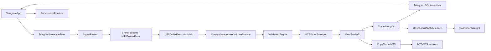

🌐 Language: [Français](./COMPLETE_TECHNICAL_INVENTORY_NOVABOT_2026-08-13_FR.md) | [English](./COMPLETE_TECHNICAL_INVENTORY_NOVABOT_2026-08-13_EN.md)

---

# Complete Technical Inventory of NovaBOT

## Consolidated technical update — August 14, 2026

This pass was recalculated from the active project-root source tree, excluding backups, generated Python artifacts, and working reports under `Markdown`. It is authoritative over the counts and wiring in the retained August 13 baseline below.

### Current AST counts

| Item | Production/technical | Tests | Total |
|---|---:|---:|---:|
| Python files | 171 | 77 | 248 |
| Classes | 214 | 195 | 409 |
| Functions outside classes | 399 | 37 | 436 |
| Methods and class-scoped callbacks | 2,142 | 1,482 | 3,624 |
| Constructors | 117 | 66 | 183 |
| Async definitions | 46 | 21 | 67 |
| Properties | 37 | 0 | 37 |
| Dataclasses | 44 | 0 | 44 |
| Enums | 6 | 0 | 6 |
| Decorated PyQt slots | 11 | 0 | 11 |
| Declared PyQt signals | 36 | 0 | 36 |
| `QTimer`/`singleShot` sites | 29 | 0 | 29 |
| Explicit Thread/Process/Popen constructors | 8 | 0 | 8 |

Methods include local callbacks declared lexically under class scope. Dynamic calls, Qt connections, and registered handlers are not treated as absent calls. This pass counts only explicit thread/process constructors, so that row is not directly comparable to a broader textual search.

### Newly verified components and responsibilities

| File | Definition or responsibility | Main relationships | Status |
|---|---|---|---|
| `app/core/module_scroll_viewport.py` | `ModuleScrollViewport` | wraps Telegram, MetaTrader, Dashboard, and Copy Trader from `main.py` | active UI |
| `app/core/display_policy.py` | `HistoryPanelPlan`, `build_history_panel_plan` | computes the non-priority global-console height | UI policy |
| `app/core/display_adaptation.py` | window and dialog adaptation | applies display mode and typography to application dialogs | UI infrastructure |
| `app/core/i18n.py` | technical translation-domain loading | reads `language/*/technical.json` | active infrastructure |
| `app/mt4/mt4_connection_worker.py` | cancellable MT4 connection outside the UI thread | builds/opens `MT4PlatformSession` | active Qt worker |
| `app/mt4/mt4_platform_session.py` | MT4 session and authentication directory | worker process, transport, adapter, connection errors | active |
| `app/workers/mt4_worker.py` | profile INI, dynamic endpoints, ownership, READY identity | MT4 terminal, ZeroMQ, EA | active process |
| `app/copy_trader/mt4_shared_source.py` | MT4 snapshots/diffs without persistent cache | primary MT4 session, MT4→MT5 Copy Trader | optional active |
| `app/trading/execution_admission_policy.py` | `should_adjust_take_profits_to_actual_entry` rule | MT4/MT5 execution and lifecycle | active policy |

### MT4 bridge ports and ownership

`app/workers/mt4_worker.py` keeps 6001/6002 as the first compatible pair and can scan up to 32 pairs, advancing two ports per pair. The worker records ownership per event port under the Windows temporary directory, publishes active endpoints, and only reclaims a worker when ownership is sufficiently proven. The EA receives the selected endpoints; historical constants are defaults rather than a process-wide monopoly.

### MT4 authentication and persistence

`MT4ConnectionWorker` receives `authentication_dir`; `MT4PlatformSession` forwards it to the worker process; `MT4TerminalProcessManager` creates a temporary `NovaBOT_MT4_Login_*.ini` there, removes orphaned files, and deletes the active file after use. Both the primary module and Copy Trader use `SECRETS_DIR/mt4_runtime`, which is scoped to the active profile.

Persistent credentials remain owned by `MT4CredentialsStore`. The INI is not a new account database; it is a transient artifact for the terminal’s official startup flow.

### MT4 observation and performance

`MT4PlatformAdapter` exposes normalized snapshots and facts. `MT4TradeMonitoringMixin` reuses coherent reads within one cycle; `MT4SharedSourceObserver` diffs live snapshots without a persisted cache file; the Copy Trader bounds events processed per UI pass. The worker uses a rotating log and throttles repeated identical messages.

### Strengthened MT4 lifecycle

`MT4TradeLifecycleMixin` now explicitly handles pending-to-position promotion inside the existing batch, exact ticket-history lookups, partial evidence, and deferred reevaluation. `MT4TradeClassifierMixin` uses initial levels, exit price, action type, and available history to distinguish TP, SL, break-even, secured, Smart, and manual exits. The EA exposes the required live requests; terminal-loaded MT4 history remains an observable external limitation.

### UI and global console

`main.py` retains direct references to actual modules while adding their `ModuleScrollViewport` wrappers to tabs. `_refresh_visible_module` delegates through the wrapper. The global-console plan is recomputed when size or display mode changes, and current policy exposes two visible lines in every mode. The console retains scrolling and no longer forces height at the module’s expense.

### Languages

Ten `technical.json` files exist, one per language. Technical keys are covered by `test_connection_technical_i18n_contract.py`, while notification contracts remain independently tested. Actual-entry TP-adjustment descriptions are present in all `documentation.json` files and visible summaries in all `mt5.json` files.

### Tests added since the August 13 baseline

Relevant test files include:

- `test_module_scroll_viewport.py`;
- `test_connection_technical_i18n_contract.py`;
- `test_mt4_graceful_shutdown.py` and extensions to `test_mt4_worker_characterization.py`;
- extensions to `test_mt4_primary_platform_architecture.py`;
- extensions to `test_copy_trader_mt4_shared_source.py` and `test_copy_trader_poll_characterization.py`;
- extensions to `test_display_adaptation.py`;
- extensions to `test_mt5_order_execution_characterization.py` and `test_mt5_trade_lifecycle_characterization.py`, also covering the MT4 path.

Latest documented full state: 1,016 tests, 30 historical assertion failures, 0 errors.

## August 13, 2026 consolidated technical baseline (retained history)

This section records the AST traversal and wiring verified on August 13, 2026. It is retained for traceability; the August 14 counts and additions at the top of this document are authoritative.

### Current counts

| Item | Production/technical | Tests | Total |
|---|---:|---:|---:|
| Python files | 170 | 75 | 245 |
| Classes | 211 | 191 | 402 |
| Functions outside classes | 387 | 37 | 424 |
| Methods and class-scoped callbacks | 2,111 | 1,431 | 3,542 |
| Constructors | 115 | 65 | 180 |
| Async definitions | 46 | 21 | 67 |
| Properties | 36 | 0 | 36 |
| Dataclasses | 43 | 0 | 43 |
| Enums | 6 | 0 | 6 |
| Decorated PyQt slots | 11 | 0 | 11 |
| Declared PyQt signals | 36 | 0 | 36 |
| QTimer/singleShot sites | 25 | 0 | 25 |
| Detected thread/process sites | 12 | 2 | 14 |

Method counting uses lexical AST class scope and includes method-local callbacks; it does not claim to measure dynamic invocation.

### New structural packages

| Package | Technical owner | Major dependencies | Status |
|---|---|---|---|
| `app.trading` | shared MT4/MT5 contracts and services | dataclasses, Protocols, profile stores | active infrastructure |
| `app.mt4` | primary MT4 engine | worker, ZeroMQ, EA, Qt connection worker | active |
| `app.copy_trader.mt4_shared_source` | primary MT4 observation toward MT5 | live MT4 session and Copy Trader mapping | optional active |
| `app.metatrader` | convergence namespace | no standalone domain symbol | infrastructure |

### Primary MT4 engine inventory

| File | Structural definitions | Actual role |
|---|---|---|
| `mt4_composition.py` | `MT4DomainMixins` | composes MT4 execution, actions, Smart, math, monitoring, classifier, messages, lifecycle |
| `mt4_trading_engine.py` | `MT4TradingEngine` | domain facade attached to the MetaTrader widget |
| `mt4_platform_session.py` | `MT4PlatformSession` | owns transport, adapter, connect/disconnect lifecycle |
| `mt4_platform_adapter.py` | `MT4QueueTransport`, `MT4PlatformAdapter` | converts worker request/response data into trading models |
| `mt4_connection_worker.py` | `MT4ConnectionWorker(QThread)` | opens MT4 session outside the UI thread |
| `mt4_credentials_store.py` | `MT4CredentialsStore` | encrypts/restores profile-scoped MT4 credentials |
| `mt4_order_transport.py` | `MT4OrderTransport` | OPEN and pending modifications |
| `mt4_position_transport.py` | `MT4PositionTransport` | close and position modification |
| `mt4_order_execution.py` | `MT4OrderExecutionMixin` | final admission, volume plan, MARKET/LIMIT/STOP, composite batch, execution messages |
| `mt4_position_actions.py` | `MT4PositionActionsMixin` | break-even, modifications, closes, pending deletion |
| `mt4_smart_close.py` | `MT4SmartCloseMixin` | full/partial Smart Close and aggregation |
| `mt4_trade_math.py` | `MT4TradeMathMixin` | MT4 numeric conversion, volume, tolerance |
| `mt4_trade_monitoring.py` | `MT4TradeMonitoringMixin` | periodic live positions/pending/tick observation |
| `mt4_trade_classifier.py` | `MT4TradeClassifierMixin` | MT4 close evidence and cause classification |
| `mt4_trade_messages.py` | `MT4TradeMessagesMixin` and `build_*` facades | lifecycle, Smart, pending, and completion text |
| `mt4_trade_lifecycle.py` | `MT4TradeLifecycleMixin` | batches, correlations, BE, TP, pending, completion, publication |
| `mt4_state_reconciler.py` | `MT4StateReconciler` | orders and reconciles live snapshots |
| `mt4_bridge_installer.py` | result/status/compiler/process classes | bundle, data-folder resolution, verification, compilation, launcher |
| `mt4_post_install_configurator.py` | `MT4PostInstallConfigurator` | assisted Windows post-install configuration |
| `NovaBot_MT4_Slave_ZMQ.mq4` | MT4 EA | account, terminal, symbols, specs, ticks, rates, inventories, history, actions |

### MT4 bridge contracts

`app/workers/mt4_worker.py` owns exact terminal launch, temporary login INI, bridge-owner file, careful invisible-worker recovery, ZeroMQ sockets, and queue/JSON translation.

The EA implements reads for account, terminal, symbols, selection, specification, tick, rates, positions, pending orders, and history; actions for open, close ticket/volume, delete pending, and modify position/pending; and READY, HEARTBEAT, snapshots, correlated responses, errors, and action events.

`MT4QueueTransport` correlates requests. `MT4PlatformAdapter` converts responses to `PlatformAccount`, `TerminalStatus`, `SymbolSpec`, `Quote`, `Candle`, `OpenPosition`, `PendingOrder`, `HistoricalExecution`, and `ExecutionReceipt`.

### Shared `app.trading` layer

| File | Content |
|---|---|
| `models.py` | platform/side/type enums and account, terminal, market, operation, command, receipt, event dataclasses |
| `ports.py` | session, broker-facts, market-data, action, and event Protocols |
| `platform_registry.py` | MT4/MT5 service registration and active selection |
| `runtime_state.py` | thread-safe connection/account/terminal/generation state |
| `platform_profile_store.py` | per-profile active-platform persistence |
| `platform_text.py` | MT4/MT5 text adaptation |
| `money_management_volume_planner.py` | shared owner of volume planning |
| `trade_numeric.py`, `trade_protection_policy.py`, `progressive_tp.py` | genuinely shared behavior |
| `lifecycle_*.py` | runtime state, terminal event/transition/publisher, acknowledgement, watchlist |
| `dashboard_terminal_*.py` | passive Dashboard evidence and archiving |
| `metatrader_protocol.py`, `trade_protocol.py` | contracts/compatibility facades |

Empty same-name modules under `app.mt5` are compatibility re-export facades for the shared layer.

### Shared MT4 Copy Trader source

`mt4_shared_source.py` defines `SharedSourceEvent`, normalizes MT4 positions/pending, diffs live snapshots, and observes the primary session. It handles new/update/close, pending-to-position, and residual-ticket replacement after partial close.

Residual replacement transfers the target mapping and triggers target-volume reduction, never OPEN. MT4→MT4 is prohibited; MT5→MT5/MT4 remains preserved.

### State ownership and persistence

| State | Owner | Source of truth |
|---|---|---|
| active platform | `MT5App` plus `TradingPlatformRegistry` | connected session/profile |
| MT4 connection | `MT4PlatformSession`/`MT4ConnectionWorker` | EA READY, heartbeat, identity |
| MT4 broker facts | `MT4PlatformAdapter` | live EA responses |
| MT4 batches | `MT4TradeLifecycleMixin` | live inventories/events plus runtime state |
| MT4 recovery | dedicated stores | recovery aid only |
| Copy Trader mapping | `CopyTraderMT5` | persistent association validated against inventories |
| analytics | `DashboardAnalyticsStore` | SQLite projection, never execution authority |

MT4 persistence includes `data/trading_platform.json`, encrypted MT4 credentials/key, `data/be_watchlist_mt4.json`, profile logs, temporary bridge owner, temporary login INI, temporary installer bundle, and the bundled `app/mt4/vendor/mql-zmq-802c86c9e3647c917151ff724ffd15baa9bc152c.zip`. None replaces live platform facts.

### Tests

The suite now has 75 test files. MT4-focused coverage includes primary-platform architecture, runtime connection, graceful shutdown, engine separation, bridge installer, worker characterization, and shared Copy Trader source.

Observed result with the project Python environment: 978 tests, 26 assertion failures, 0 errors. Compilation succeeds. Existing failures are reported rather than corrected or hidden.

Inventory date: August 13, 2026  
Source of truth: source code in the analyzed folder  
Document type: reference static/dynamic mapping; no source-code changes

## 1. Scope and method

This inventory covers all 364 useful files, excluding generated `__pycache__` and `.pyc` artifacts. Existing documents were used only for cross-checking; counts, symbols, imports, persistence, wiring, and contracts were verified in current code.

Method: complete tree classification; AST analysis of 245 Python files; implementation and `main.py` wiring review; file/SQLite/Telegram/MT5/MT4/ZeroMQ access search; import/call-chain reconstruction; review of all 75 test modules and 978 scenarios; and comparison with compilation/test results obtained on this same copy.

### 1.1 Counting conventions

| Measure | Convention |
|---|---|
| Production/technical Python file | Any `.py` outside `validation/tests`, including scripts, PyInstaller hook, and vendored QR library. |
| Function | `FunctionDef`/`AsyncFunctionDef` without a class ancestor. |
| Method | Function with a class ancestor: 1,489 direct methods and 52 method-local callbacks. |
| PyQt signal | Static assignment to `pyqtSignal(...)`. |
| Timer | Six recurring `QTimer` objects plus thirteen `singleShot` scheduling sites. |

### 1.2 Quantitative results

| Item | Production/technical | Tests | Total |
|---|---:|---:|---:|
| Python files | 170 | 75 | 245 |
| Classes | 211 | 191 | 402 |
| Functions | 387 | 37 | 424 |
| Methods/callbacks | 2,111 | 1,431 | 3,542 |
| Constructors | 115 | 65 | 180 |
| Async functions/methods | 46 | 21 | 67 |
| Properties | 36 | 0 | 36 |
| Dataclasses | 43 | — | 43 |
| Enums | 6 | — | 6 |
| Decorated PyQt slots | 11 | — | 11 |
| Declared PyQt signals | 36 | — | 36 |

The tree also contains 80 language JSON files, 18 PNGs, 9 Markdown files, 5 BAT files, 2 PowerShell scripts, one PyInstaller SPEC, one ICO, one MQ4 EA, one text notice, and one bundled mql-zmq archive.

## 2. Packages and entry points

`app` is a namespace package. `app.core`, `app.mt5`, `app.telegram`, `app.copy_trader`, and `app.workers` are namespace subpackages; `app.dashboard`, `app.onboarding`, and `app.supervision` expose `__init__.py` facades. `validation` is a regular package, with namespace subpackages for market, rules, and scoring.

| Package | Technical role | Status |
|---|---|---|
| `app.core` | preferences, profiles, i18n, display, atomic storage, analytics | infrastructure |
| `app.telegram` | Telethon session, listener, filter, forwarding, Smart, outbox | active |
| `app.mt5` | connection, parser, admission, execution, actions, lifecycle | active |
| `app.dashboard` | analytics projection and UI | UI |
| `app.copy_trader` | MT5→MT5/MT4 plus shared MT4→MT5 orchestration | optional active |
| `app.workers` | multiprocessing source/target and MT4 ZeroMQ bridge | infrastructure |
| `app.onboarding` | profile setup checklist | UI |
| `app.supervision` | read-only remote projection | optional infrastructure |
| `validation` | models, market context, rules, scoring, history | optional active |

Primary entry points are `main.py/main()`, `main.bat`, `main.ps1`, the multi-profile launcher, build/backup BAT files, `scripts/diagnostic_supervision_distante.py`, MT4 installer scripts, `worker_main`, `mt4_worker_main`, `rthooks/freeze_support.py`, `NovaBot.spec`, and the MT4 EA. The only explicit application CLI option is `--profile`.

## 3. External dependencies

PyQt5 owns UI/signals/threads/timers; Telethon owns Telegram; MetaTrader5 owns broker access; cryptography/Fernet protects credentials; pyzmq transports MT4 commands/events; SQLite stores analytics/outbox; multiprocessing hosts workers; Windows ctypes/DPAPI handles process integration/token protection; optional pywinauto activates MT5 Algo Trading; vendored qrcodegen creates pairing QR codes. Standard-library dependencies include filesystem, JSON, datetime, typing/dataclasses, regex, threading, math/time, subprocess, socket, HTTP, and urllib.

## 4. Component graph and main wiring

`MainWindow._wire_signals` connects Telegram trade envelopes to MT5, MT5 publications to Telegram, durable outbox acknowledgements to lifecycle, selected sources to identity/Dashboard, the Smart detector to Telegram filtering, the primary MT5 session to Copy Trader, and status events to supervision.

## 5. Concurrency, workers, asyncio, and timers

Four QThreads are defined: Telegram `AsyncWorker`, Telegram `LoopRunner`, MT5 connection/symbol worker, and Dashboard snapshot worker. Copy Trader can start one MT5 source process and one MT5/MT4 target process. Supervision uses one HTTP thread. Telegram's dedicated asyncio loop runs inside `LoopRunner`. The MT4 installer is a temporary PowerShell child process.

The recurring timers are Copy Trader poll (150 ms), installer poll (500 ms), Dashboard refresh (30 s), MT5 watchdog (2.5 s), lifecycle/BE poll (2 s), and onboarding refresh (1.5 s). Thirteen `singleShot` sites handle deferred UI, auto-connect, icon/display refresh, and asynchronous completion.

## 6. PyQt signals and slots

The 32 signals belong to Dashboard snapshot/Widget, MT5 connection worker/MT5App, Onboarding coordinator/dialog, Telegram AsyncWorker/dialogs/TelegramApp. They carry worker results, status, trade publications, supervision events, reconnect state, selected-source changes, setup readiness, and durable outbox acknowledgement.

The ten decorated Telegram slots are `send_text_to_group`, `on_create_bot_finished`, `get_phone_number_dialog`, `request_code_dialog`, `update_button_text`, `update_status`, `_handle_telegram_reconnect_event`, `on_worker_finished_ok`, `on_worker_finished_err`, and `on_get_chats_finished`.

## 7. Routes and protocols

Supervision exposes only GET `/supervision/health`, `/identity`, `/snapshot`, and `/events?after=N`; private-mode protected routes require Bearer auth. HEAD/POST/PUT/PATCH/DELETE/OPTIONS/TRACE/CONNECT return 405.

Telegram uses Telethon client calls and handlers, not webhooks. MT5 reads go through `MT5BrokerFacts`; actions go through `MT5ActionGateway.send_order`, then order/position transports. MT4 uses ZeroMQ `tcp://127.0.0.1:6001` commands and `:6002` events. `%TEMP%/NovaBot_MT4_bridge_6002.json` records bridge ownership.

## 8. File-by-file inventory

### 8.1 Root, build, and core

| File | Role / main symbols | State |
|---|---|---|
| `main.py` | `ProfileDialog`, `MainWindow`, startup/profile lock/delayed imports/wiring/shutdown | active UI |
| BAT/PS1 launchers | developer, multi-profile, build, and backup entry points | infrastructure |
| `NovaBot.spec`, `rthooks/freeze_support.py` | PyInstaller data/hidden imports and multiprocessing hook | build infrastructure |
| `scripts/diagnostic_supervision_distante.py` | standalone argparse HTTP diagnostic | active utility |
| `app/core/about_dialog.py` | About dialog/buttons and release metadata | UI |
| `app/core/app_preferences.py` | language/theme/display/font/startup settings | infrastructure |
| `app/core/atomic_json.py` | atomic temp/fsync/replace JSON write | infrastructure |
| `app/core/dashboard_analytics.py` | SQLite schema and Telegram/parser/execution/terminal recording | active store |
| `app/core/dashboard_statistics.py` | periods, aggregation, scoring, totals | active service |
| `app/core/display_adaptation.py`, `display_policy.py` | display controller and immutable `DisplayPlan` policy | UI/infrastructure |
| `app/core/documentation.py`, `i18n.py` | documentation UI and eight translation domains | infrastructure |
| `app/core/launch_options.py` | `extract_profile_argument` | active |
| `app/core/profile_json_store.py`, `profile_manager.py` | tolerant/atomic store, profiles, safe ZIP, PID locks | active infrastructure |
| `app/core/startup_settings_dialog.py` | startup/display/supervision/token/QR settings | UI |
| `app/core/tab_bar_adaptation.py`, `typography.py` | stable tab sizing and font scaling | UI infrastructure |

### 8.2 Dashboard and onboarding

`app/dashboard/dashboard.py` defines `_SnapshotWorker(QThread)`, `_SortableItem`, and `DashboardWidget`. It owns period/source selection, refresh timer, sortable rows, details, non-destructive source reset, themes, and formatting.

Onboarding files define `OnboardingRepository`, immutable `SetupStep`/`StepState`, `OnboardingService`, `OnboardingCoordinator(QObject)`, and `OnboardingDialog`. Repository owns `onboarding.json`; service evaluates eight existing module states; coordinator owns navigation/timer/signals; dialog owns presentation.

### 8.3 MT5 files

| Area | Files / symbols | Role |
|---|---|---|
| Facade | `connect_metatrader_mt5.py`: `ConnectionDialog`, worker, `MT5App` | UI, settings, connection, parser, correlation, validation, lifecycle composition |
| Composition/state | `mt5_composition.py`, `mt5_runtime_state.py`, `lifecycle_runtime_state.py` | stable mixin order and mutable state owners |
| Discovery/startup | `metatrader_discovery.py`, `metatrader_server_discovery.py`, `mt5_startup.py`, `symbol_info_store.py` | cached terminal/server discovery and stable symbol cache |
| Reads/actions | `mt5_broker_facts.py`, `mt5_action_gateway.py` | MT5 read and write gateways |
| Admission | `execution_admission_policy.py` | geometry, asset family, automatic/point tolerances |
| Historical policy | `execution_order_policy.py` | old slippage decision, production-unwired |
| MM | `money_management.py`, repository, volume planner, `trade_numeric.py` | settings/UI, capital/risk/volume/split/offset |
| Parser/aliases | `signal_parser.py`, parser adapters, `symbol_aliases.py` | text instructions and broker resolution |
| Execution | `mt5_order_execution.py`, `mt5_order_transport.py`, protocol | admission→validation→orders and filling fallbacks |
| Position actions | `mt5_position_actions.py`, `mt5_position_transport.py`, `trade_protection_policy.py` | close/partial/BE/SL/TP/pending |
| Smart close | `mt5_smart_close.py`, `smart_action_gateway.py`, `smart_command_executor.py` | scoped composite Smart actions |
| Monitoring/classification | `mt5_trade_monitoring.py`, `mt5_trade_classifier.py` | readiness/duplicates/ticks/history/closure cause |
| Lifecycle | `mt5_trade_lifecycle.py`, watchlist/ACK/terminal event/transition/publishers | persistent tracking and idempotent terminal publication |
| Presentation | `mt5_trade_messages.py` | MT5-independent trade message rendering |
| Analytics evidence | dashboard terminal evidence/archiver | attributable terminal facts to Dashboard |
| Correction | `telegram_signal_correction.py` | safe in-place edited-signal changes |
| Stores/math | `trade_log_store.py`, `progressive_tp.py`, `mt5_trade_math.py` | trade log, partial-close policy, pips/euros/prices |

`MT5DomainMixins` order is execution, position actions, Smart close, monitoring, lifecycle, classifier, messages, and math. `MT5OrderExecutionMixin.execute_trade` normalizes, resolves, admits, prices, calculates volume, validates, sends, publishes, and arms tracking. `MT5TradeLifecycleMixin` contains 67 methods covering restoration, TP/BE, split branches, pending orders, manual events, progressive closes, terminal evidence, publication, and cleanup.

### 8.4 Telegram files

`connect_telegram.py` defines `AsyncWorker`, `LoopRunner`, phone/trade/messages/chats/API/outbox dialogs, and `TelegramApp`. It owns Telethon connection, authorization, bot/private group, listening, source selection, filtering, forwarding/copy, reply mapping, edited/deleted handlers, durable outbox, reconnection, and the MT5 bridge.

Supporting modules are bot-admin promotion; selected-chat/profile settings stores; filter defaults/store/engine/policy/contracts/dialog; forward-map store; deleted-message audit; SQLite outbox and delivery service; reconnect dataclass/policy; Smart persistence/detector/resolver/engine; and Telegram correlation state/service.

`SmartAutomationEngine` owns dictionaries/detection/context/validation/dispatch but not raw MT5 actions. `TelegramNotificationOutboxStore` owns schema migration, corruption recovery, leases, ordering, retry/dead-letter/context, and pruning.

### 8.5 Copy Trader, workers, and MT4

`copy_trader_mt5.py` defines dataclasses `ConnInfo`/`AppState` and `CopyTraderMT5`. It owns UI, encrypted state, terminal/server discovery, shared/manual source, worker processes/queues, initial-sync review, inventories, aliases, target-ticket mapping, OPEN/UPDATE/CLOSE replication, installer, and shutdown.

`mt5_worker.py` defines `ConnectReq`, `StopReq`, `OrderCmd`, `EventMsg` plus connection, symbol scoring, target actions, source inventory, transitions, and loop. `mt4_worker.py` defines `MT4TerminalLauncher`, Windows PID/port ownership helpers, rotating logs, JSON/ZeroMQ bridge, and loop. The MQ4 EA is the target executor; installer scripts deploy mql-zmq and EA files.

### 8.6 Supervision

The package defines immutable identity/event/batch/snapshot dataclasses; thread-safe `SupervisionProjection`, `SupervisionEventStream`, `SupervisionRuntime`; passive `DesktopStateObserver`; settings/token/DPAPI/network/pairing services; `SupervisionTransportService`; and read-only `SupervisionHttpTransport`. Vendored `QrCode`, `QrSegment`, `_BitBuffer`, and `DataTooLongError` support pairing.

### 8.7 Validation

`validation/config.py` defines slots dataclasses `SymbolValidationConfig`/`ValidationConfig`; `models.py` defines `TradeSide`, `DecisionStatus`, `RuleSeverity`, and slots dataclasses `Signal`, `MarketSnapshot`, `RuleResult`, `ValidationDecision`. `MarketContext` owns facts/EMA/ATR. Rules cover broker metadata, geometry, spread, trend, ATR, volume, and risk. `ValidationRuleEvaluator`, `DecisionManager`, and `ValidationEngine` own evaluation/scoring/decision. `ValidationHistoryStore` is the fail-open CSV writer.

### 8.8 Languages and resources

Ten language folders each contain `main`, `telegram`, `mt5`, `copy_mt5`, `dashboard`, `documentation`, `notifications`, and `onboarding` JSON catalogs. PNG/ICO resources provide logos, settings/profile-status icons, documentation/dictionary icons, and language flags.

## 9. Class, function, and method responsibilities

### 9.1 UI/orchestration

`ProfileDialog` builds profile/language/theme/actions and executes create/delete/import/export/accept. `MainWindow` builds four tabs, initializes supervision/onboarding, wires modules, projects identity state, and performs orderly shutdown. `DashboardWidget` owns asynchronous snapshots and visible statistics. About, documentation, startup-settings, display-adaptation, and onboarding classes own presentation and delegate business state to services/repositories.

### 9.2 MT5

`MT5App` direct methods group into UI, logging, credentials, connection/watchdog, settings/MM delegation, snapshots/validation, parser/symbol cache, Telegram correlation, external-message execution, Smart calls, and supervision events. Its mixins own domain behavior.

`MT5OrderExecutionMixin` call sequence is `_normalize_execution_params` → `_resolve_execution_symbol` → `_initialize_execution_batch` → `_prepare_trade_admission`/`_decide_execution_entry`/`_prepare_execution_prices` → `_build_execution_volumes`/`_validate_execution_plan` → autotrading preflight → `_send_trade_orders` → `_finalize_trade_execution`/tracking.

`MT5PositionActionsMixin` owns selection of batch positions/orders, pending modifications/removal, secure/BE, full/half/progressive close, and SL/TP updates. `MT5SmartCloseMixin` resolves exact context and closes positions plus pending orders. Monitoring owns readiness/duplicates/live ticks; classifier owns historical evidence; lifecycle owns all persistent transitions; messages owns rendering only.

### 9.3 Telegram

`TelegramApp` direct methods group into credentials/readiness, worker/log management, selected sources/listening, UI/themes, outbox/publication, authorization/reconnect, bot/group operations, forwarding/replies/media, handlers, and shutdown. Dialog classes own only their temporary UI state. Filter/audit/outbox/correlation/Smart stores and services own their respective persistent or in-memory boundaries.

### 9.4 Copy Trader/workers

`CopyTraderMT5` groups methods into UI/state, process connection, shared MT5 source, safe startup review, replication handlers, mapping/inventory, poll, and shutdown. Workers are command/event loops with dataclass contracts. Local support classes include `EventCollector`, Windows `ProcessEntry32W`/`TcpRowOwnerPid`, `CapturedEvents`, DPAPI `_DataBlob`, and QR `Ecc`/`Mode`; they are not standalone services.

## 10. Actual call chains

Telegram: Telethon handler → passive deletion audit → filter policy/engine → `new_trade_text` → `MT5App.process_external_message` → parser/correction → TP offset/correlation → `execute_trade` → broker resolution/admission/MM/validation → transports/gateway → MT5 → lifecycle → presenter → SQLite outbox → Telethon reply → durable ACK → Dashboard/supervision.

Smart: filter Smart detector → exact reply/batch correlation → `SmartAutomationEngine.handle_command` → validator → executor → Smart gateway → scoped MT5 method → business notification.

MT5 connection: dialog/credentials → QThread startup job → `MetaTrader5.initialize` → symbol-info cache → finalize → watchdog/lifecycle restoration/shared Copy Trader source.

Copy Trader: confirmed source/target → inventory/mapping review → poll source events → target symbol/volume command → MT5/MT4 worker → confirmation → persistent ticket map.

## 11. Mutable state and owners

| State | Owner | Persistence / consumers |
|---|---|---|
| active profile | profile manager | global config; all repositories |
| global preferences | app preferences | `.novabot/config.json`; UI/i18n |
| Telegram session/listener | `TelegramApp` | secrets/session/settings; handlers/outbox |
| selected sources | Telegram/SelectedChatsStore | JSON; listener/MM/Dashboard |
| filter/processed | `TelegramMessageFilter` | two JSON + log |
| forward map/deletion audit/outbox | dedicated stores | JSON/log/SQLite; replies/lifecycle |
| message↔batch correlations | `TelegramCorrelationState`/MT5 runtime | memory plus watchlist reflection |
| MM settings | `MoneyManagementController` | `mt5_app_settings.json`; execution/lifecycle |
| symbol aliases/cache | MT5 stores | aliases JSON/symbol-info JSON |
| batches/watchlist | lifecycle runtime | `be_watchlist.json`; Smart/monitoring/notifications |
| analytics | `DashboardAnalyticsStore` | SQLite; Dashboard |
| Copy Trader | `CopyTraderMT5` | settings/map/logs; workers |
| supervision | `SupervisionRuntime` | settings/token only; HTTP |
| onboarding | repository/service | `onboarding.json`; dialog/global button |

## 12. Persistence map

Global artifacts are `.novabot/config.json` and per-profile `.profile.lock`. Profile `data` contains startup/app settings, selected chats, filter settings/processed data, deletion cache, forward map, notification outbox, group ID, Smart dictionary, MT5/MM settings, lifecycle watchlist, chat history, aliases, Copy Trader settings/map, onboarding, and Dashboard SQLite.

`secrets` contains Telegram/Copy Fernet key, encrypted Telegram API/bot data, and MT5 key/encrypted credentials. `sessions` contains Telethon SQLite/session sidecars. `mt5_sessions` contains canonical and legacy symbol-info JSON.

`logs` contains Telegram/MT5/Copy console histories, filter/deleted/transferred/Smart logs, market snapshots, trade log, validation CSV, and MT4 worker log. Supervision has `settings.json` and DPAPI `token.protected`. Temporary artifacts include bridge owner JSON and extracted installer bundle. Forty named persistent artifacts/families were identified, excluding 80 read-only language catalogs and dynamic backups/sidecars.

## 13. Significant constants and caches

Important globals include release/About metadata; theme/display/font/startup defaults; i18n caches; active profile; Dashboard store singleton/lock; MetaTrader discovery cache/lock; central server catalog; `DEFAULT_MM_SETTINGS`; progressive presets; symbol families/aliases; execution sentinels; retcode 10027; filter version/limits/rules; reconnect delays; deletion/outbox limits; MT4 endpoints/heartbeat; worker symbol suffix hints; supervision defaults; and immutable onboarding steps.

## 14. Potentially unused, historical, or indirect elements

| Element | Evidence | Confidence / state |
|---|---|---|
| `ExecutionOrderPolicy` | no production import; characterized by tests; current decision is in execution mixin | very probable test/compatibility only |
| `rthooks/freeze_support.py` | no Python import, referenced by build | confirmed active build infrastructure |
| supervision diagnostic script | standalone `main`, no app import | confirmed active utility |
| qrcodegen | indirect pairing import | confirmed active vendored code |
| Dashboard/observer/service direct-import gaps | imported dynamically/facade from `main` | confirmed active |
| dated symbol-info and old forward-map formats | explicit fallback/migration and tests | confirmed historical compatibility |
| message-builder facades | preserve access without MT5 instance | probable public compatibility |
| `ExecutionAdmissionPolicy.is_tradable` | called but always true | active neutral hook |
| Qt/Telethon callbacks and AST-only branches | dynamic connections/patching | cannot determine statically; not dead-code candidates |

No other fully isolated production module was found.

## 15. Test inventory

All 75 files were reviewed. Their domains are:

- architecture/core/UI: About, refactor contracts, display, documentation, themes, MM layout/group override, onboarding, CLI/profile manager, typography, tabs, language cache;
- Telegram: API recovery, bot admin, deletion audit, filter/UI/routing, listener refresh, outbox, authorization, reconnect, edited-signal correction, reply publication;
- MT5: market context, autotrading, execution, position actions, Smart Close, classifier, lifecycle, math, messages, monitoring, workers, progressive TP, parser, validation, asset-family thresholds, aliases, symbol store;
- Dashboard: analytics and statistics;
- supervision: foundations, network, notifications, pairing, private config, transport, transport events;
- Copy Trader/MT4: poll/initial synchronization/source sharing/mapping/replication, worker/EA/installer/build contracts.

Direct live coverage is intentionally absent for real broker execution, real Telethon/BotFather network behavior, all visual/localized rendering, end-to-end PowerShell installation across arbitrary MT4 builds, a compiled EA on a live terminal, all UIA variants, and some text-log ACL/disk failures. Facade/AST coverage must not be mistaken for no coverage.

Observed suite: `python -m unittest discover -s validation/tests -p "test_*.py"` ran 978 tests with 26 assertion failures and 0 errors. `python -m compileall app validation main.py` succeeded. Existing failures were not changed or hidden.

## 16. Structural component summary

| Element | Name/file | Role | State |
|---|---|---|---|
| Entry | `main.py/main` | desktop/profile startup | active |
| Telegram facade | `TelegramApp` | session/listener/transfer/outbox | active |
| Filter | `TelegramMessageFilter` | message admission | active |
| Parser | `SignalParser` | text to instructions | active |
| MT5 facade | `MT5App` | UI/orchestration | active |
| Admission/MM/validation | policy/controller/planner/engine | order and risk admission | active/optional |
| Facts/actions/transports | MT5 gateways | broker I/O boundaries | infrastructure |
| Execution/lifecycle/messages | MT5 mixins | orders, tracking, presentation | active |
| Smart/correlation | Smart engine + batch service | reply-scoped actions | active |
| Outbox/analytics | SQLite stores | durable delivery/evidence | infrastructure |
| Dashboard | `DashboardWidget` | passive statistics | UI |
| Copy Trader/workers | CopyTrader + MT5/MT4 loops | replication | optional active |
| Onboarding | coordinator/service/repository | checklist | UI |
| Supervision | runtime/observer/HTTP | passive read-only projection | optional active |

## 17. Final summary

1. 364 useful files analyzed.
2. 170 production/technical Python files.
3. 75 test files.
4. 211 production/technical classes; 402 including tests.
5. 387 production/technical functions; 424 including tests.
6. 2,111 production/technical methods/callbacks; 3,542 including tests.
7. 36 PyQt signals and 11 decorated slots.
8. Twelve production thread/process creation sites detected by AST, in addition to the dedicated asyncio loop and externally launched installer/terminal processes.
9. Twenty-five timer sites: eight recurring QTimer constructions and seventeen single-shots.
10. Forty persistent artifacts/families, including two SQLite databases.
11. Main dependencies: PyQt5, Telethon, MetaTrader5, cryptography/Fernet, pyzmq, SQLite, optional pywinauto, and Windows/network/concurrency stdlib.
12. Main state owners: profile manager, TelegramApp/stores, platform registry/runtime, separate MT4 and MT5 lifecycles, MM controller, Dashboard store, CopyTraderMT5, and SupervisionRuntime.
13. Main path: Telegram → filter → parser → aliases → admission/MM/validation → selected MT4 or MT5 transport → platform lifecycle → durable Telegram notifications → Dashboard/supervision.
14. `ExecutionOrderPolicy` is the only domain module imported only by tests in the current graph; other apparently isolated files are entry points, hooks, historical fallbacks, or dynamically wired components.

## 18. Inventory limits

Static analysis cannot prove every branch activated through Qt, Telethon, MT5, broker state, inheritance, monkeypatching, or dynamic callbacks. “Potentially unused” classifications are therefore conservative. External terminal/network/broker/EA behavior is documented only where code or tests establish the contract. This file is an English translation; no NovaBOT source, setting, or test was modified.
